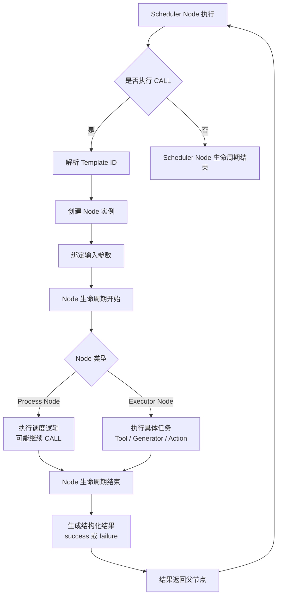
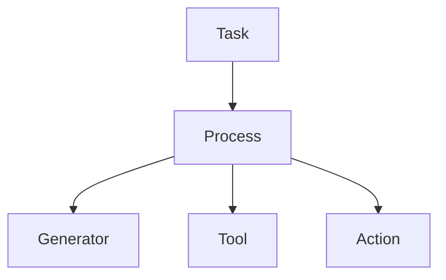
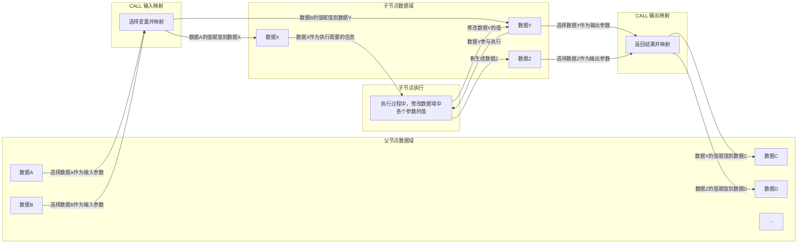
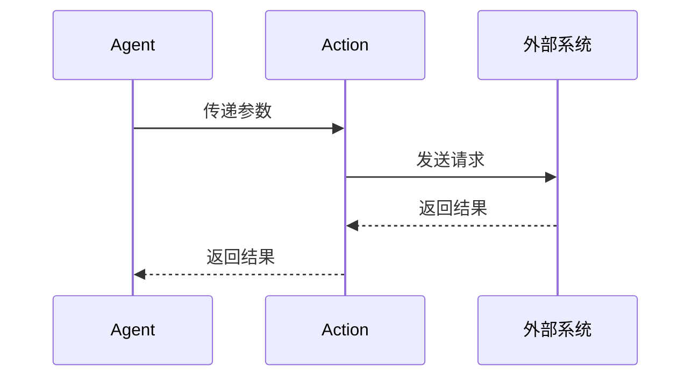

# Mindloom 语义规范（v0.2）

# 第一章：语言定位与设计哲学

## 1.1 Mindloom 的本体

**Mindloom** 是一种基于自然语言的编程语言，它的设计目的是让编程人员通过结构化语言与自然语言表达 **AI** 的执行任务和逻辑控制，而非传统的编程方式。它与传统的 **Agent** 系统、调度器或虚拟机不同，是为编程人员提供的一个编程框架，通过语言和结构化参数表达，这种设计允许编程人员通过结构化的语言逻辑描述任意 **Agent** 的行为，而不需要深入学习计算机编程语言本身。

在传统编程中，开发者需要学习特定的编程语言和环境。**Mindloom** 摒弃了这一技术门槛，使用自然语言描述逻辑，并通过结构化模板来管理任务和流程的执行。这种方式让没有编程基础但具备特定领域知识、业务背景和逻辑思维能力的人，如提示工程师和业务专家，也能参与到 **AI** 的编程过程中，从而使编程更具包容性和普适性。在最新的 **AI LLM** 技术加持下，编程将更聚焦其原始的定义——**一个逻辑设计与表达的过程**，而不是一个技术性高度依赖特定编程语言的活动。

## 1.2 Mindloom 作为自然语言编程的表达工具

**Mindloom** 提供了一种新型的编程模式，模板是 **Mindloom** 中的核心载体，负责表达编程逻辑和提示工程师的设计思想。它通过结构化的语言定义了系统的执行规则、数据流动和任务控制等内容。提示工程师通过自然语言的方式设计系统的结构，并将这些设计转换为易于理解和执行的模板。模板的设计与传统代码的结构类似，但在 **Mindloom** 中，它更注重于逻辑的表达和系统行为的定义，而不依赖于特定编程语言的语法。

这些模板通常使用 **JSON** 格式进行存储，可以通过文件系统或数据库进行管理。通过模板，提示工程师可以设计任务的执行流程、数据的输入与输出、错误处理机制等。 **Mindloom** 引擎在运行时会加载这些模板，并根据其定义的结构执行相应的任务。每个模板都定义了明确的执行契约，包括输入输出项、执行流程的顺序、参数的验证、执行结果的结构等，确保了任务的可控性和可预测性。

通过这种方式，Mindloom 实现了自然语言编程与结构化模板的结合，使得复杂的执行逻辑能够通过简洁的表达方式设计，并且可以通过引擎加载后执行，最终结合外部操作形成一个完整的 **Agent** 。

## 1.3 Mindloom 的设计哲学

**Mindloom** 的设计哲学基于对 **AI LLM** 能力的理解。 **AI LLM** 可以处理低脑力、简单的决策任务，但它的智能和控制力是有限的，不能替代人类在高层次、核心决策中的作用。因此，**Mindloom** 的设计不依赖 **AI** 的完全决策，而是将高层决策和核心控制交给人类，仅允许末端决策交给 **AI** 。高层的决策仍依赖并信任提示工程师、业务专家及最终用户的设计。因此，**Mindloom** 的设计哲学是**强约束的限制性语义**。

### 1.3.1 限制 AI 的完全决策能力

**Mindloom** 避免将完全的决策能力交给 **AI**。**AI LLM** 在完全自主决策时，可能产生不可预期的结果，这可能导致混乱或难以理解的错误。**Mindloom** 通过明确的逻辑控制结构和预定义的流程，确保所有决策过程都能由人类设计和管理，从而保持系统的可预测性。每个执行单元都严格定义了其输入、输出和执行逻辑，避免了 **AI** 在执行过程中做出不符合预期的决策。

### 1.3.2 牺牲自由度换取可控性

**Mindloom** 的设计放弃了编程中的某些**自由度**，旨在获得更高的**可控性**和**可预测性**。在执行过程中，系统中的每个步骤都是闭包的，执行逻辑必须经过精心设计和预定义，其结果都是可以预知的。具体来说，每个步骤通过调用执行与结束，每个调用执行完毕后，返回到上层的调用，直到最外层的执行完毕，整个任务才会结束。运行逻辑可以理解为迭代调用或递归调用，类似数据结构中的压栈和出栈。系统的结构化和控制流的明确，使得每个执行节点都有一个确定的起点和终点，防止了系统陷入无法预期的行为。

和传统的基于 **next指针** 的 **AI Agent** 编程框架、工作流编排软件不同，**Mindloom** 的设计是**基于调用（CALL）的**。这样的设计避免了任意跳转、回跳等不确定的控制结构，也避免了复杂的图结构设计，例如需要全局节点关联关系检测是否是标准的**有向无环图（DAG）**，为高复杂度、大规模、多 **Agent** 的设计保证了执行可控性和稳定性。

但是也需要强调弊端，这个定义降低了天马行空想象力和高质量高效率的 **Agent** 设计的可能性，限制了提示工程设计者发挥创造力。语义设计需要在自由度和可控性上做取舍，当面向更广大的非计算机背景用户时，牺牲自由度换取可控性，让语义定义为提示工程设计者的混乱逻辑与错误流程兜底。

---

# 第二章： Mindloom 的核心概念

本章将介绍 **Mindloom** 语义的核心概念，包括**语义组件**和**语义基本术语**，这些概念共同构成了 **Mindloom** 的基本语义。

## 2.1 语义组件

语义组件是 **Mindloom** 系统中的重要构成单元，它包括 **调度器（Scheduler）** 和 **执行器（Executor）** 两个大类。每个语义组件负责定义和控制系统中的特定任务或行为。具体的语义组件包括 **任务（Task）** 、 **流程（Process）** 、 **AI 生成器（Generator）** 、 **工具（Tool）** 和 **操作（Action）** ，系统中的每个单元、节点都是某种语义组件的具体体现。它们共同构建了一个灵活且可控的执行框架。

```mermaid
graph TD
    A[语义组件] --> B[调度器（Scheduler）]
    A --> C[执行器（Executor）]

    B --> D[任务（Task）]
    B --> E[流程（Process）]

    C --> F[AI 生成器（Generator）]
    C --> G[工具（Tool）]
    C --> H[操作（Action）]
````

在 Mindloom 中，所有的执行单元和节点逻辑都可以归纳为 **调度器（Scheduler）** 和 **执行器（Executor）** 两大类。每一类组件都具备特定的职责和功能。

### 2.1.1 调度器（Scheduler）

调度器组件主要负责控制 **Agent** 的执行工作流。它包括以下两种类型：

* **任务（Task）**：任务组件是执行的最外层单元，代表一个完整的 **Agent** 生命周期。任务定义了执行的入口和出口，并通过 **CALL** 触发后续的流程。
* **流程（Process）**：流程组件是 **Agent** 运行流程控制的核心，定义了运行过程的工作流，包括顺序、分支、循环、并行等执行逻辑。

调度器组件负责确保 **Agent** 的有序执行，它们通过控制节点之间的执行关系来实现业务逻辑。

### 2.1.2 执行器（Executor）

执行器组件负责执行具体的操作任务。它们的功能并不涉及流程控制，而是专注于完成具体的任务。执行器组件包括以下几种类型：

* **AI 生成器（Generator）**：AI 生成器组件负责与 **AI** 模型（如 **LLM** ）交互，通过输入提示生成内容，并返回生成结果。
* **工具（Tool）**：工具组件提供引擎内置的基本功能，如计算、数据处理等。
* **操作（Action）**：操作组件负责引擎与外部系统进行交互，调用外部服务或执行外部接口的程序。

执行器组件的作用是根据输入参数执行实际的计算或操作任务，并返回执行结果。

## 2.2 语义术语

语义术语包括引擎（Engine）、提示工程（Prompt Engineering）、模板（Template）、单元（Unit）、节点（Node）、智能体（Agent）、调用（CALL）和数据域（Data Scope），以下是对这些概念的详细解释。

### 2.2.1 引擎（Engine）

**引擎** 也被称为 **Mindloom 引擎**，是 **Mindloom** 语义解释与执行的程序软件，负责加载和解释模板，驱动任务的流程控制，并在执行过程中处理数据流、参数验证以及错误管理等。引擎根据设计的模板和定义的语义逻辑，调度并执行各个语义单元，执行语义节点，确保 **Agent** 按照提示工程师的设计准确执行。

### 2.2.2 提示工程（Prompt Engineering）

**提示工程** 是人类表达 **Agent** 运行思路设计过程，涉及到如何通过构建和优化模板来表达系统行为和决策逻辑。提示工程是在AI LLM技术爆发后兴起的一门全新的编程**学问**，也可以指一次构建 **Agent** 的过程。在 Mindloom 语义中，这一过程特指设计、编写、调整、优化和组合 **模版** 的工作，因为 Mindloom 语境里模版集合就是提示工程的完整表达， **提示工程师（Prompt Engineer）** 是这一工作的角色，负责确保这些模板能够准确传递所需的逻辑和实施。

### 2.2.3 模板（Template）

**模板** 又叫 **提示模板（Prompt Template）** 是 **Mindloom** 中执行单元的静态结构化定义，通常以 **JSON** 或 **YAML** 等格式存储在文件系统或数据库中，用于描述 **执行单元** 的身份信息、输入输出契约以及执行逻辑结构，并作为 **Mindloom 引擎** 在运行时加载与解析的原始来源。

### 2.2.4 单元（Unit）

**单元** 又叫 **模板单元** ，是 **Mindloom 引擎** 在解析 **模板** 后形成的执行语义抽象，用于表达模板所定义的执行逻辑与输入输出契约，并在语义校验通过后作为创建运行时执行节点的基础对象存在于解析阶段。

单元分类为调度器单元（Scheduler Unit）和执行器单元（Executor Unit）两大类。调度器单元又分为任务单元（Task Unit）和流程单元（Process Unit），执行器单元分为AI 生成器单元（Generator Unit）、工具单元（Tool Unit）和操作单元（Action Unit）。每个单元至少包含模板 ID（Template Id）、名称（Name）、描述（Description）、输入参数定义（Inputs）与输出参数定义（Outputs）这五个基础元素，在每个具体类型单元上会增加自身特有的元素，如调度器单元会有调度方案定义，流程单元会有流程类型定义、条件判断定义等。

### 2.2.5 节点（Node）

**节点** 又叫 **执行节点** ，是 **Mindloom 引擎** 在执行过程中基于 **单元** 创建的运行时执行实例，表示一次具体的执行过程与生命周期，是 **Agent** 运行时最小的执行单位、追踪单位与调试单位。

同单元类似，单元分类为调度器节点（Scheduler Node）和执行器节点（Executor Node）两大类。调度器节点又分为任务节点（Task Node）和流程节点（Process Node），执行器节点分为AI 生成器节点（Generator Node）、工具节点（Tool Node）和操作节点（Action Node）。

### 2.2.6 智能体（Agent）

**智能体（Agent）** 在广义语境中指通过 **Mindloom 模板**、**Mindloom 引擎** 以及外部工具或操作接口共同构成的完整执行系统。该系统能够按照模板定义的任务流程运行，并与现实世界进行交互。

在 **Mindloom** 语义规范 中，**Agent** 采用狭义定义：**Agent** 指由一组 **模板单元** 组成的任务逻辑集合，用于描述任务流程结构、执行节点关系以及数据输入输出契约。在结构上，一个 **Agent** 通常以 **Task 模板** 作为执行入口，并通过一个或多个 **Process 模板** 组织执行流程。流程中的具体能力由 **Generator**、**Tool**、**Action** 等**执行器模板** 提供，这些模板共同组成 **Agent** 的完整任务逻辑结构。

### 2.2.7 调用（CALL）

**调用（CALL）** 是单元执行的核心机制，在 **Mindloom 引擎** 运行过程中，**CALL** 由 **调度器** 发起，表示从一个执行节点到另一个执行节点的跳跃。在 **Mindloom** 中，除了最开始的 **Task 节点** 由引擎直接调起，其余 **节点** 执行都是通过 **CALL** 触发的。 **CALL** 的本质是一个 **模板单元** 加载变成 **执行节点** 的过程，它将输入传递给目标节点，执行目标节点定义的逻辑，并等待其返回结果或捕获异常。 **CALL** 是执行流程中的原子操作，确保了每一步的执行和返回都具有明确的开始和结束或者错误处置。

### 2.2.8 数据域（Data Scope）

**数据域（Data Scope）** 或者叫数据作用域，每个单元或节点内数据的作用范围。在 **Mindloom 引擎** 执行过程中，每个节点的数据是局部的，存放在 **节点变量空间** 中，仅在当前 **节点** 内有效，不与其他节点共享数据。数据域的隔离确保了每个执行节点的独立性，使得执行过程更加可控和可预测。

---

# 第三章：语义公理

本章将明确 **Mindloom** 系统的核心公理，构建清晰的语义框架，为后续描述奠定原则基础。

* **结构化结果契约为第一原则**

    结构化结果是 **Mindloom** 执行的核心，所有执行必须遵循结果契约。执行结果必须符合预定义的结构，并与模板声明的输出一致。无论执行成功与否，结果的结构都必须被严格校验，保证系统的可预测性和稳定性。

* **Mindloom 的表达层独立于具体运行实现**

    **Mindloom** 专注于表达执行结构，而非具体的实现。通过语言抽象与执行实现的分离，确保系统在不同执行环境和调度器实现下的灵活性与扩展性。这种分离使得模板可以在不同平台和技术栈上保持一致的执行语义。

* **调用为唯一执行跃迁机制**

    **CALL** 作为唯一的执行跃迁机制，是 **Mindloom** 中从一个执行状态到另一个执行状态的桥梁。每次执行实施的方式是 **CALL** ，它负责触发执行过程并传递控制流。所有其他的执行动作包括 **Process** 调度、 **Tool** 使用、 **Action** 实施和 **Generator** 都依赖于调用的机制，确保了系统的递归计算和一致性。

* **控制权始终显式存在于某一层级**

    在 **Mindloom** 系统中，控制权始终属于某一 **调度器（Task 或 Process）** 层级中。运行过程中控制权的转移从 **父调度器节点** 到 **子调度器节点** 始终显式可见，这保证了系统内的执行流动是透明和可追溯的。控制权的层次分明避免了不必要的复杂性。

* **数据默认强隔离，不允许隐式共享状态**

    数据隔离是 **Mindloom** 系统的一项基本原则。执行单元之间的数据必须通过显式的输入输出进行传递，任何隐式的共享状态都是不被允许的。每个执行 **节点** 的 **数据域** 是独立的，确保不同执行节点的状态不会互相干扰或影响，增强了系统的可控性和安全性。

* **错误必须被某一层裁决**

    错误的裁决路径必须在执行模型中显式定义，避免系统的不确定性。**Mindloom** 中的错误传播是分层的， **Process** 可以裁决错误，而 **执行器** 永不恢复错误。所有错误最终会收敛到 **Task** 进行处理，确保错误的处理逻辑清晰且一致。

* **外部世界交互视为显式执行节点**

    **Mindloom** 系统通过 **Tool** 和 **Action** 与外部世界进行交互，这些交互不被视为副作用，而是系统的一等公民。调用内部工具和执行外部操作是 **Mindloom** 执行模型的一部分，具有明确的语义地位。这确保了外部交互的可靠性和可控性。

* **结构确定性优先于概率自由**

    在 **Mindloom** 中，结构化的确定性优先于基于概率的自由推理。系统追求可预测和可控的执行过程，避免过度依赖不确定性或概率推理。这种设计保证了执行路径的稳定性，并提高了系统在实际应用中的可靠性。

---

# 第四章：执行跃迁模型

本章将描述 **Mindloom 的执行机制**，即系统在运行时如何从一个执行状态跃迁到另一个执行状态，以及各执行单元之间如何通过 **CALL** 形成完整的执行过程。

Mindloom 的运行过程可以抽象为一个逐步展开并最终收敛的执行结构。系统从 **Task 节点** 启动，在执行过程中不断创建新的执行节点，并在节点生命周期结束后返回结果。随着执行的推进，系统逐步形成一棵完整的执行结构，并最终收敛到任务节点的结束。

Mindloom 的运行时结构可以理解为一种 **树形执行系统**。每个执行步骤都对应一个节点，节点之间通过 **CALL** 建立父子关系，从而形成清晰的执行层级。

## 4.1 执行结构

在 Mindloom 中，**执行节点（Node）** 是运行时的基本执行单位。每当系统执行一个单元时，引擎都会创建一个对应的节点实例，并为该节点分配唯一的运行标识和独立的执行上下文环境。

节点之间通过 **CALL** 建立父子关系。当一个节点调用另一个单元时，引擎会加载目标单元并创建新的节点实例。调用方节点成为父节点，被调用节点成为子节点。

随着执行不断展开，系统会逐渐形成一棵 **执行树结构（Execution Tree）**。
在这棵树中：

* 每个节点都有唯一的父节点（Task 节点除外）
* 子节点执行完成后，其结果会返回给父节点
* 父节点根据返回结果继续执行后续逻辑

通过这种结构，整个执行过程始终保持清晰的层级关系，并且所有执行路径都可以从任务节点进行追溯。

```mermaid
graph TD

T[Task Node]

T --> P1[Process Node]

P1 --> G1[Generator Node]
P1 --> T1[Tool Node]

P1 --> P2[Process Node]

P2 --> A1[Action Node]
P2 --> T2[Tool Node]
```

在 Mindloom 中，**Task 节点是整个执行结构的入口节点**。

每一次 **Agent** 运行时，引擎会首先加载任务单元，并创建唯一的 **Task Node**。该节点由引擎直接启动，而不是通过 **CALL** 创建。因此，在一次执行过程中始终只存在 **一个 Task 节点**。

Task 节点构成执行树的根节点，并负责启动整个执行流程。通常情况下，Task 节点内部会定义一个主 **CALL**，用于触发后续的执行流程。

通过这种结构，Mindloom 的执行路径始终保持清晰可追踪，并且所有执行流程最终都会收敛到任务节点的结束。

## 4.2 执行跃迁

在 Mindloom 中，**执行跃迁（Execution Transition）** 指系统从一个执行节点转移到另一个执行节点的过程。

Mindloom 只允许通过 **CALL** 进行执行跃迁。

当一个节点执行 **CALL** 时，引擎会根据调用定义解析目标模板，并加载对应的单元。随后系统会创建新的执行节点，并将该节点加入当前执行结构中。新节点开始执行其自身逻辑，而父节点会等待子节点执行完成后再继续执行。

因此，在 Mindloom 中：

> **CALL 是唯一的执行跃迁机制。**

这种设计避免了任意跳转或不受约束的流程控制，使执行结构始终保持清晰和可预测。执行流程只能通过节点之间的调用关系展开，而不会形成复杂的图结构或不可追踪的执行路径。

从语义上看，Mindloom 的 **CALL** 与传统编程语言中的函数调用存在相似之处，但其语义更接近于：

> **创建一个新的执行节点，并等待该节点生命周期结束。**

通过这一机制，系统能够在运行过程中逐步构建完整的执行结构，并在节点结束后逐层返回结果。

## 4.3 CALL 的执行生命周期

当节点执行 **CALL** 时，引擎会按照固定的执行流程创建并运行新的节点。
这一过程构成了 **CALL 的执行生命周期**。

CALL 的执行通常包含以下阶段：

1. **模板解析**

   调度器节点根据 **CALL** 定义解析目标模板 ID，并加载对应的单元定义。

2. **节点创建**

   引擎根据单元定义实例化新的节点。系统会为该节点分配唯一的 **运行标识（Node ID）** ，用于标识此次执行生命周期。

3. **参数绑定**

   调用节点将输入参数传递给新节点。参数以值复制的方式进入子节点的数据域，子节点对数据的修改不会影响父节点。

4. **节点执行**

   新节点开始执行其自身逻辑。
   如果节点为 **执行器节点**，则直接执行对应任务并生成结果；如果节点为 **调度器节点**，则可能继续发起新的 **CALL**。

5. **生命周期结束**

   节点执行完成后结束其生命周期，并生成执行结果。执行结果必须符合模板定义的输出结构。

6. **结果返回**

   执行结果返回给发起 **CALL** 的父节点，由父节点根据自身调度逻辑决定后续执行流程。

在整个过程中，父节点会等待子节点执行结束。对于并行流程节点，父节点可以同时发起多个 **CALL**，并在所有子节点完成后继续执行。



通过这一生命周期模型，Mindloom 保证了每个执行节点都具有明确的开始与结束，并且执行结果能够沿调用路径逐层返回。

## 4.4 Task 与 Process 节点

在 **Mindloom** 的执行结构中，**Task 节点** 与 **Process 节点** 都属于 **调度器节点** ，它们负责组织执行流程。

**Task 节点** 是执行结构的入口节点，由引擎启动创建，并作为整个执行树的根节点。 **Task 节点** 通常只承担启动流程的职责，通过一个或多个 **CALL** 触发后续执行单元。

**Process 节点** 是执行流程的核心调度节点。与 **Task 节点** 不同，**Process 节点** 是在运行过程中通过 **CALL** 创建的，并在执行过程中承担主要的流程控制职责。

Process 节点可以根据模板定义发起多个 **CALL**，从而生成新的执行节点。这些节点可以是：

* **Process 节点**
* **Generator 节点**
* **Tool 节点**
* **Action 节点**

不同类型的 **Process** 可以定义不同的调度策略，例如顺序执行、条件分支、循环执行或并行执行等。

通过 **Task 节点** 与 **Process 节点** 的协同作用，**Mindloom** 构建出完整的执行结构，并保证整个执行过程始终保持结构化与可追踪。

---

# 第五章：控制权与裁决模型

本章将阐述 **Mindloom 系统中的控制权与执行裁决模型**。

**Mindloom** 的执行系统采用 **调度器控制结构**，在该结构中执行流程由 **调度器节点** 控制，而执行结果由 **调度器** 逐层解释与裁决。

## 5.1 执行角色与控制权

在 **Mindloom** 的执行体系中，执行节点根据职责被划分为两种角色：

* **调度器（Scheduler）**
* **执行器（Executor）**

**调度器** 负责组织执行流程，并决定系统的下一步行为。
**执行器** 负责完成具体任务，并返回执行结果。

在执行过程中，系统遵循以下控制原则：

* 控制权始终存在于 **调度器节点**
* **执行器节点** 不会获得控制权
* **执行结果** 由调度器节点解释与处理

因此，在 **Mindloom** 中：

> **执行器永远不会控制程序的执行流程。**

执行器只负责完成任务，而执行流程的组织与控制始终由调度器节点决定。

## 5.2 控制权转移规则

在 **Mindloom** 中，**CALL** 是唯一的执行跃迁机制。

当调度器节点执行 **CALL** 时，会创建新的执行节点。
控制权是否发生转移取决于 **CALL** 的目标类型。

系统采用以下规则：

* 当 **CALL** 的目标是 **Process 单元** 时，控制权转移到新的流程节点
* 当 **CALL** 的目标是 **Executor 单元** 时，控制权保持在当前调度器节点

因此，控制权只会在 **调度器节点之间转移**，而不会转移到执行器节点。

下图展示了 **Mindloom** 的执行控制结构。



在该结构中：

* **Task 与 Process 为调度器节点**
* **Generator、Tool、Action 为执行器节点**

执行器节点负责完成任务，但不会改变执行结构或控制流程。

## 5.3 执行结果裁决

当执行节点完成任务后，会返回 **执行结果（Execution Result）**。
系统需要根据该结果决定下一步行为，这一过程称为 **执行裁决（Arbitration）**。

执行结果通常包含两种状态：

* **success** 节点执行成功，返回输出参数
* **failure** 节点执行失败，返回错误信息

在 **Mindloom** 中：

> **错误不是异常事件，而是执行结果的一种类型。**

调度器节点会根据执行结果决定后续流程。

### 5.3.1 成功结果处理

当执行结果为 **success** 时，调度器节点会根据 **CALL** 定义的输出映射规则，将返回的输出参数写入当前节点的 **数据域**。

完成参数写入后，流程继续按照既定结构执行后续步骤。

因此，成功结果的处理通常包括两个步骤：

* 输出参数写入节点数据域
* 继续执行后续流程

### 5.3.2 错误处理策略

当执行结果为 **failure** 时，调度器节点需要决定如何处理该错误。

**Process 节点** 可以在 **CALL** 定义中声明错误处理策略。

如果 **CALL** 未声明错误处理策略，则系统采用默认行为：

* **propagate**（向上传播）

该行为表示当前节点不处理该错误，而是将执行结果返回给父节点。

如果 **CALL** 声明了错误处理策略，则属于 **错误处置（Error Handling）**。

当前版本的 **Mindloom** 支持以下 **错误处置** 策略：

- **retry** 重新执行该 **CALL**
- **ignore** 忽略错误并继续执行流程
- **default** 使用预定义的默认输出继续执行流程

通过这些策略，**Process 节点** 可以在流程层面对执行错误进行灵活处理。

## 5.4 执行结果传播

执行结果沿 **CALL 调用链** 向上传播。

当执行节点返回 **failure** 且当前 **CALL** 未声明错误处理策略时，系统会采用 **propagate** 行为：

* 当前 **Process 节点** 立即结束执行
* 错误结果返回到调用它的父节点

父节点接收到错误结果后，可以再次进行裁决：

* 定义错误处理策略，对错误进行处置
* 继续使用 **propagate** 将错误向上传播

如果错误持续向上传播，最终会到达 **Task 节点**。
此时，Task 节点将决定 **Agent** 的最终执行结果。

这一机制对应 **Mindloom** 的语义原则：

> **错误必须被某一层裁决。**

特殊的，在并行执行场景中，错误传播遵循相同规则。

当 **Process** 同时发起多个 **CALL** 时，如果其中某个 **CALL** 返回 **failure** 且策略为 **propagate**，系统将按以下原则处理：

* 当前 **Process 节点** 立即终止执行
* 其余仍在运行的并行节点会被终止
* 错误结果向上传播

因此，并行执行不会改变错误传播路径。

整体来看，执行结果传播机制可以总结为：

* **执行器** 只产生执行结果
* **Process** 可以裁决结果，也可以选择 **向上传播**
* **Task** 决定 **Agent** 的最终执行结果

通过这种传播机制：

* 执行路径与结果路径保持一致
* 每个执行结果都可以被追踪
* 每个执行结果最终都会被裁决

从而保证执行结构的稳定性，同时允许流程层定义灵活的错误处理策略。

---

# 第六章：数据域模型

本章节将阐述 **Mindloom** 系统中的数据模型及节点级数据作用域规则，说明数据在执行过程中的流动、隔离与生命周期管理方式，并明确内部临时数据与外部持久数据的区分原则。

Mindloom 的执行系统遵循 **节点级数据隔离模型**，所有数据仅存在于节点的局部作用域中，通过 **CALL** 的输入与输出显式映射在节点之间传递。
这种设计保证了执行过程的数据依赖始终明确、可追踪，且节点间不会共享状态。

## 6.1 数据模型概述

### 6.1.1 数据模型核心原则

**Mindloom** 的数据模型核心原则如下：

* 数据始终绑定于 **执行节点（Node）**；
* 每个节点在运行时都会拥有独立的 **节点数据空间**，用于保存其执行所需的全部数据；
* 节点之间不共享变量，也不存在全局数据区域；
* 所有数据交换必须通过 **CALL** 显式传递。

通过这一设计，系统的数据流动严格遵循节点的执行结构，使数据依赖可清晰理解和追踪。

### 6.1.2 节点的数据作用域

在 Mindloom 中，**执行节点是唯一的数据作用域单位**。

当一个节点被创建时，引擎会为该节点分配独立的数据空间，用于保存该节点在执行过程中所需要的全部数据。节点接收来自调用方的输入参数，并在执行过程中对这些数据进行处理，最终在节点结束时生成输出结果。

节点内部的数据通常经历三个阶段：

1. 节点创建时接收输入参数  
2. 节点执行过程中对数据进行处理与更新  
3. 节点结束时生成输出结果并返回调用方  

可以将这一过程理解为：

**输入数据 → 节点执行 → 输出结果**

在执行过程中，节点可以读取或修改自身的数据，但这些数据不会被其他节点直接访问。不同节点之间的数据始终保持隔离，从而避免复杂的共享状态问题。

## 6.2 CALL 与参数传递

在 Mindloom 中，**CALL 是节点之间进行数据传递的唯一机制**。

为了保证数据边界明确，CALL 过程遵循以下完整流程：

1. **输入映射**：父节点选择部分数据，通过模板定义的映射规则传递给子节点；不是所有父节点变量都会传递。
2. **子节点执行**：子节点使用映射后的输入进行计算，生成中间变量，内部可修改输入值，但只在本节点可见。
3. **输出映射**：子节点根据输出映射规则，将指定结果返回父节点；未在输出映射中定义的变量不会返回。
4. **值复制语义**：传递给子节点的数据是父节点数据的副本，子节点的修改不会影响父节点



通过这种方式，节点之间的数据依赖始终显式体现，**不存在隐式共享或全局变量**，保证了执行语义的确定性与可追溯性。

## 6.3 数据生命周期与并行执行

### 6.3.1 节点生命周期与数据绑定

在 **Mindloom** 中，**数据的生命周期与节点的生命周期严格绑定**。

当节点被创建时，引擎会为其分配数据空间，并将输入参数写入该空间。在节点执行过程中，节点可以对这些数据进行读取与修改。当节点执行结束后，系统会生成输出结果并返回给调用方。

节点结束后，其内部数据空间会被释放，该节点的数据也随之消失。

因此，**Mindloom** 的运行过程中不会产生长期驻留的内部状态。所有节点的数据都只在其生命周期内存在，并随着节点的结束而被销毁。

### 6.3.2 并行执行的数据隔离与冲突处理

在并行流程中，多个 **CALL** 可以同时执行。

并行执行不会改变 **Mindloom** 的数据隔离原则。每个并行节点仍然拥有独立的数据作用域，并按照相同的调用机制进行数据传递。

需要注意的是，当多个并行 **CALL** 尝试将结果使用写入同一变量时，可能产生写入冲突。在这种情况下，变量的值是 **最后运行完的 CALL 的输出参数** 覆盖的值。

因此，在设计并行流程时，通常应避免使用同一个变量名作为 **CALL** 输出的映射参数，在需要汇总多个并行结果的情况下，可以使用独立变量保存各个结果，并在后续流程中进行统一处理。

通过这种方式，系统仍然能够保持清晰的数据结构与执行逻辑。

## 6.4 外部扩展与受控共享数据

**Mindloom** 内部数据语义严格隔离以保证可预测性，但通过 **Tool** 和 **Action** 可以在受控条件下实现跨节点数据访问或长期数据存储，从而在保持语义边界的同时提供必要的灵活性。

### 6.4.1 持久化数据方案

**Mindloom** 的基础执行语义 **不提供持久数据存储能力**。

节点内部的数据只在执行期间存在。如果需要保存长期数据，例如业务数据、历史记录或外部系统状态，则必须通过外部系统实现。这类操作通常通过 **Tool** 或 **Action** 节点完成。

例如：

* 通过 **Tool** 访问数据库或文件系统
* 通过 **Action** 调用外部服务接口
* 通过外部系统保存长期业务数据

通过这种方式，**Mindloom** 将执行过程中的临时数据与系统外部的持久数据明确区分，从而保持执行系统本身的简洁与稳定。

### 6.4.2 跨数据域访问与数据共享方案

**Mindloom** 的基础执行语义**不支持全局变量、跨节点共享或直接交换数据**。

在某些场景下，需要跨节点共享数据或实现状态持久化时，可以通过 **Tool** 或 **Action** 节点访问外部系统或共享数据空间。此时，**Tool** 提供的数据访问能力需要用户自行控制，例如：

* 通过 **Tool** 提供的接口读取或写入共享变量；
* 使用 **Tool** 内部提供的锁机制，避免并行访问冲突或死锁；
* 通过外部系统管理数据一致性与事务边界，确保逻辑正确性。

这种设计使得 **Mindloom** 在保持严格数据隔离的基础上，仍可提供必要的灵活性。**跨数据域访问的控制责任完全由使用者承担**，系统本身不会自动管理共享状态。

通过明确区分节点内部数据与 **Tool** 提供的共享数据，**Mindloom** 保持了执行语义的清晰性与可预测性，同时允许在必要时实现受控的跨节点数据交换。

---

# 第七章：AI认知与生成模型

本章节将阐述 **Mindloom** 中 **AI** 的语义定位与执行原则，说明 **AI** 如何在保持执行结构确定性的前提下参与决策与内容生成。

## 7.1 AI的语义位置

在 Mindloom 的语义体系中，**AI** 被定义为一种 **执行能力**。即表达 **AI** 能力的语义组件 **AI 生成器（Generator）** 隶属于 **执行器** ，和 **Tool** 、 **Action** 属于同一层级。
AI生成器不参与流程结构的定义，也不直接控制执行流程，仅仅执行一次 **AI** 模型相关 **API** 的调用，解析 **API** 的输出并返回结果。

这种设计保证：

* **AI** 可以参与决策与内容生成
* **AI** 不会破坏执行结构
* 整个执行体系总体保持结构化与可推理、可预测、可重试

换言之：

> **Mindloom** 并不是让 **AI** 控制程序，而是让程序 **结构化地使用 AI 的能力**。

**AI** 在 **Mindloom** 中的能力主要体现在**AI参与决策**与**AI内容生成**两个方面。

### 7.1.1 AI参与决策

**AI** 可以通过语义理解参与执行决策，例如：

* 判断用户意图
* 判断任务是否完成
* 判断流程是否继续
* 对信息进行分类或分析

在这种模式下：

* **Generator 提供语义判断结果**
* **Process 根据结果决定流程结构**

因此：

> **AI** 提供判断，而流程结构始终由 **Process** 控制。

这种机制允许 **AI** 参与“思考”，同时保持系统执行结构的确定性。

### 7.1.2 AI内容生成

**AI** 还可以作为 **内容生成器**，生成各种文本或语义内容，例如：

* 文本回复
* 文档内容
* 指令文本
* 程序代码
* 结构化信息

这些内容可以作为后续执行单元的输入，例如：

* **AI** 生成邮件内容 → **Action** 发送邮件
* **AI** 生成回复消息 → **Action** 发送聊天消息
* **AI** 生成执行指令 → **Tool** 或 **Action** 执行操作

在这种模式中：

* **AI 负责生成内容**
* **Tool 或 Action 负责执行行为**

因此 **AI** 在 **Mindloom** 中既可以参与 **决策过程**，也可以参与 **内容生产过程**。

## 7.2 结构化输入与结构化输出

**AI LLM** 模型的运行机制基于 **Token 与字符串生成**，而 **Mindloom** 的执行体系采用 **结构化参数与结构化结果**。

因此 **Generator** 的核心作用是：

> 将 **AI** 的文本生成能力接入结构化执行系统。

其基本执行语义可以抽象为：


在该过程中，**Generator** 完成三个关键任务：

* 构建提示输入
* **AI** 模型调用
* 解析模型输出

特殊的，如果 **Generator** 无法将 **AI** 输出解析为符合定义结构的结果，该执行被视为 **failure**。

### 7.2.1 提示模板与输入构建

Generator 接收来自调用节点的 **结构化输入参数**。

由于 **AI** 模型接收的是文本提示，因此需要通过 **提示模板（Prompt Template）** 将结构化参数转换为完整提示文本。

常见模板构建方式包括：**静态模板匹配填充**、**正则表达式替换**、**Python语言的jinjia2模板引擎**。

通过这些模板机制，提示工程师可以灵活地将输入参数嵌入提示内容中，形成完整的 **AI** 调用提示文本。

模板构建属于 **Generator 的内部执行语义**，其目标是将结构化数据转化为可供 **AI** 模型理解的提示文本。

### 7.2.2 结果解析与结构化输出

**AI** 模型返回的结果通常为文本内容。

为了使执行系统能够理解这些结果，需要将文本结果解析为结构化参数。

常见解析模式包括：**正则表达式替换**、**Json解析**、**Yaml解析**、**Xml解析**。

解析完成后，**Generator** 会生成结构化输出，并返回给调用节点。

通过这一机制，**AI** 的概率文本生成能力被纳入到可控的结构化执行体系中。

## 7.3 AI 模型接口兼容

**Generator** 的执行语义并不不关心 **AI** 模型内部机制，也不绑定具体的模型，仅仅使用模型提供的 **API** 接口使用 **AI** 的能力。

当前主流 **AI** 模型通常通过标准化 **API** 提供能力，其模式如下：

```chat, image, vision, completion, audio, speech, transcription, embedding, moderation, reasoning```

其中 **chat 范式** 最早由 **OpenAI GPT API** 推广，但已经成为行业通用模式。
目前大量 AI 平台都提供兼容的 API 结构，例如：

| 类型   | 示例                                                   |
| ---- | ---------------------------------------------------- |
| 国际模型 | OpenAI GPT、Anthropic Claude、Google Gemini、Meta Llama |
| 中国模型 | 阿里 Qwen、百度 ERNIE、DeepSeek、智谱 GLM                     |
| 私有部署 | 本地部署 LLM                                             |
| 企业平台 | 企业内部 AI 平台                                           |

由于这些模型大多兼容类似的 **API** 调用模式，因此 **Generator** 可以通过简单配置接入不同模型，例如：

* 基础路径
* 访问密钥
* **API** 相对路径

只要模型提供兼容的接口模式，**Generator** 即可调用其能力。

随着 **AI** 技术的发展，新的模型能力也在不断出现，如多模态模型范式，**Generator** 的设计允许持续兼容新的能力模式，使 **Mindloom** 能够不断接入新的 **AI** 模型范式，而无需改变语义。

---

# 第八章：现实世界交互模型

本章将阐述 **Mindloom** 系统中 **Tool** 和 **Action** 的概念及其角色。两者都是执行器组件，分别用于不同类型的现实世界交互。**Tool** 主要为 **Agent** 提供基础计算和数据操作能力，而 **Action** 则负责与外部现实世界进行直接交互，如控制设备或获取外部数据。

## 8.1 Tool 与 Action 的哲学与语义差异

在 **Mindloom** 的执行体系中，**Tool** 和 **Action** 都属于执行器，负责执行具体的任务。

它们在 **Mindloom** 语义区别是：

> **Tool** 的执行环境由 **Mindloom 引擎** 控制，而 **Action** 的执行环境属于外部系统。

在功能上两者允许部分重叠，但在哲学语义略微差别是：

- **Tool** 提供了标准化的操作，是引擎内的“内建”功能，专注于为 **Agent** 提供计算和数据操作能力。
- **Action** 则承担与外部世界的互动和控制任务，具有更大的灵活性，可以与现实世界中的物理设备和服务进行交互。

这种设计确保了系统的可扩展性和灵活性，使得 **Mindloom** 不仅可以处理传统的计算任务，还能与外部世界进行实时交互，极大增强了系统的应用场景。

### 8.1.1 Tool：标准化的功能与基础能力

**Tool** 侧重于提供标准化的计算和数据操作能力，主要用于引擎内部的数据流转和任务处理。其功能大多属于操作系统层面的基础能力，比如：
- **计算**（数学运算、加密算法等）
- **数据处置**（字符串处理、数据格式化、正则查找等）
- **文件操作**（Excel 文件操作、文本文件处理等）

这些操作并不直接与现实世界的物理设备或外部服务交互，而是为 **Agent** 提供基础功能，辅助执行任务和流程。提示工程师需根据**Agent**的使用场景**选择并使用**现有的 **Tool 工具集**。

### 8.1.2 Action：与现实世界的直接交互

**Action** 则是具有更高自由度的执行器，它侧重于与 **现实世界** 进行交互。通过 **Action**，**Mindloom** 能够控制物理设备、访问外部数据，甚至与外部服务进行信息交换。这些操作不仅限于传统的计算任务，还包括：
- **控制设备**（开关灯、调节窗户等）
- **获取外部数据**（天气数据、传感器数据等）
- **外部服务交互**（点外卖、网页爬虫等）

与 **Tool** 的标准化功能不同，**Action** 提供了更灵活的接入方式，提示工程师可以选择现有三方的 **Action 接口**，或定制开发新的接口以适应具体需求。

## 8.2 Tool 与 Action 的实现差异

### 8.2.1 Tool 的实现与运行逻辑

**Tool** 的运行逻辑由 **Mindloom 引擎团队** 负责实现，它们的任务是为系统提供基础功能，所有调用的参数结构和逻辑都是固定的。提示工程师只需要选择所需的 **Tool unit ID**，传入必要的参数，系统便可完成相关任务。

### 8.2.2 Action 的实现与接入方式

与 **Tool** 不同，**Action** 的实现方式更加灵活。提示工程师可以在**Unit**定义**Action**参数结构，通过选择已有的三方接口服务，或者通过定制开发与外部系统进行交互。**Mindloom 引擎** 只负责将参数传递到指定接口，并处理一些基础的错误，如超时等，不涉及具体的执行过程。**Action** 可以与外部设备进行交互，甚至在某些情况下进行系统级别的改变（如控制硬件设备）。

## 8.3 Tool 的主要功能

**Tool** 提供的功能可以按其应用场景进行分类。以下是 **Mindloom** 中一些常见的 **Tool** 类型及其功能描述：

| 类型          | 功能描述                                   | 示例                                                       |
|---------------|--------------------------------------------|------------------------------------------------------------|
| **计算类**     | 提供数学运算、加密解密、随机数等计算功能    | 数学加密计算、哈希加密、生成随机数等                       |
| **数据处置类** | 处理数据类型转换、字符串操作、正则匹配等   | 字符串截取、正则查找与替换、数据类型转换等                 |
| **数据库类**   | 操作传统数据库、向量数据库等                | 关系型数据库增删改查、向量数据库操作等                     |
| **引擎内省类** | 获取引擎当前运行状态，操作引擎内部资源      | 获取当前节点数、消耗资源情况、设置同步锁、添加全局变量等 |
| **文件操作类** | 处理各种文件格式，如Excel、Word等           | 操作Excel文件、处理HTML文件、音视频文件读写等              |
| **本地操作类** | 访问和操作本地计算机功能                    | 获取系统时间、操作相机、声音、截屏、进程管理、UI交互等    |
| **网络类**     | 与网络进行交互，发送数据包、抓包等          | HTTP请求、ICMP包发送、抓包分析等                           |

## 8.4 Action 的实现方案

与 **Tool** 的标准化不同，**Action** 主要依赖外部系统接口，它通过几种不同的方案与外部世界进行交互，具体方案包括：
- **消息队列**：用于异步任务和外部事件的通知。
- **本地文件通信**：通过文件系统与外部设备或系统交换数据。
- **REST API**：通过标准的 HTTP 请求与外部服务进行交互。



**Action** 与外部系统的所有交互均通过明确接口完成，**Mindloom** 引擎仅传递参数与返回结果

### 8.4.1 异步与回调机制
**Action** 如果在使用并行 **Process** 节点进行 **CALL** 时，可以实现异步调用。在并行执行的环境下，通过延长等待时间或设置回调机制，提示工程师可以在异步任务完成后接收结果或继续后续操作。这个机制使得 **Action** 的执行变得更加灵活，能够适应更多复杂场景。
