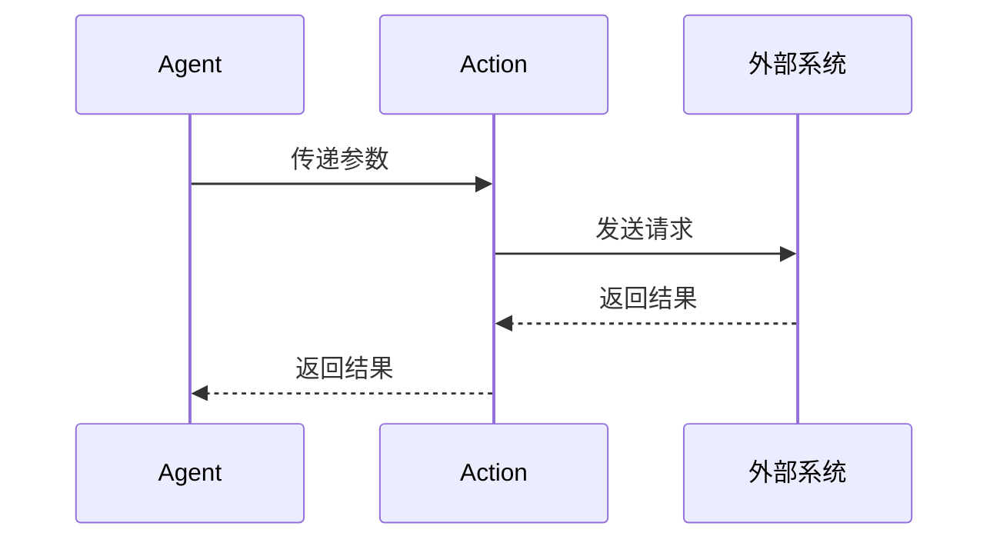

# 第八章：现实世界交互模型

本章将阐述 **Mindloom** 系统中 **Tool** 和 **Action** 的概念及其角色。两者都是执行器组件，分别用于不同类型的现实世界交互。**Tool** 主要为 **Agent** 提供基础计算和数据操作能力，而 **Action** 则负责与外部现实世界进行直接交互，如控制设备或获取外部数据。

## 8.1 Tool 与 Action 的哲学与语义差异

在 **Mindloom** 的执行体系中，**Tool** 和 **Action** 都属于执行器，负责执行具体的任务。然而，它们在设计上有着显著的区别。

- **Tool** 提供了标准化的操作，是引擎内的“内建”功能，专注于为 **Agent** 提供计算和数据操作能力。
- **Action** 则承担与外部世界的互动和控制任务，具有更大的灵活性，可以与现实世界中的物理设备和服务进行交互。

这种设计确保了系统的可扩展性和灵活性，使得 **Mindloom** 不仅可以处理传统的计算任务，还能与外部世界进行实时交互，极大增强了系统的应用场景。

### 8.1.1 Tool：标准化的功能与基础能力

**Tool** 侧重于提供标准化的计算和数据操作能力，主要用于引擎内部的数据流转和任务处理。其功能大多属于操作系统层面的基础能力，比如：
- **计算**（数学运算、加密算法等）
- **数据处置**（字符串处理、数据格式化、正则查找等）
- **文件操作**（Excel 文件操作、文本文件处理等）

这些操作并不直接与现实世界的物理设备或外部服务交互，而是为 **Agent** 提供基础功能，辅助执行任务和流程。提示工程师需根据**Agent**的使用场景**选择并使用**现有的 **Tool 工具集**。

### 8.1.2 Action：与现实世界的直接交互

**Action** 则是具有更高自由度的执行器，它侧重于与 **现实世界** 进行交互。通过 **Action**，**Mindloom** 能够控制物理设备、访问外部数据，甚至与外部服务进行信息交换。这些操作不仅限于传统的计算任务，还包括：
- **控制设备**（开关灯、调节窗户等）
- **获取外部数据**（天气数据、传感器数据等）
- **外部服务交互**（点外卖、网页爬虫等）

与 **Tool** 的标准化功能不同，**Action** 提供了更灵活的接入方式，提示工程师可以选择现有三方的 **Action 接口**，或定制开发新的接口以适应具体需求。

## 8.4 Tool 与 Action 的实现差异

### 8.4.1 Tool 的实现与运行逻辑

**Tool** 的运行逻辑由 **Mindloom 引擎团队** 负责实现，它们的任务是为系统提供基础功能，所有调用的参数结构和逻辑都是固定的。提示工程师只需要选择所需的 **Tool unit ID**，传入必要的参数，系统便可完成相关任务。

### 8.4.2 Action 的实现与接入方式

与 **Tool** 不同，**Action** 的实现方式更加灵活。提示工程师可以在**Unit**定义**Action**参数结构，通过选择已有的三方接口服务，或者通过定制开发与外部系统进行交互。**Mindloom 引擎** 只负责将参数传递到指定接口，并处理一些基础的错误，如超时等，不涉及具体的执行过程。**Action** 可以与外部设备进行交互，甚至在某些情况下进行系统级别的改变（如控制硬件设备）。

## 8.2 Tool 的主要功能

**Tool** 提供的功能可以按其应用场景进行分类。以下是 **Mindloom** 中一些常见的 **Tool** 类型及其功能描述：

| 类型          | 功能描述                                   | 示例                                                       |
|---------------|--------------------------------------------|------------------------------------------------------------|
| **计算类**     | 提供数学运算、加密解密、随机数等计算功能    | 数学加密计算、哈希加密、生成随机数等                       |
| **数据处置类** | 处理数据类型转换、字符串操作、正则匹配等   | 字符串截取、正则查找与替换、数据类型转换等                 |
| **数据库类**   | 操作传统数据库、向量数据库等                | 关系型数据库增删改查、向量数据库操作等                     |
| **引擎内省类** | 获取引擎当前运行状态，操作引擎内部资源      | 获取当前节点数、消耗资源情况、设置同步锁、添加全局变量等 |
| **文件操作类** | 处理各种文件格式，如Excel、Word等           | 操作Excel文件、处理HTML文件、音视频文件读写等              |
| **本地操作类** | 访问和操作本地计算机功能                    | 获取系统时间、操作相机、声音、截屏、进程管理、UI交互等    |
| **网络类**     | 与网络进行交互，发送数据包、抓包等          | HTTP请求、ICMP包发送、抓包分析等                           |

## 8.3 Action 的实现方案

与 **Tool** 的标准化不同，**Action** 主要依赖外部系统接口，它通过几种不同的方案与外部世界进行交互，具体方案包括：
- **消息队列**：用于异步任务和外部事件的通知。
- **本地文件通信**：通过文件系统与外部设备或系统交换数据。
- **REST API**：通过标准的 HTTP 请求与外部服务进行交互。

### 8.3.1 异步与回调机制
**Action** 如果在使用并行 **Process** 节点进行`call`时，可以实现异步调用。在并行执行的环境下，通过延长等待时间或设置回调机制，提示工程师可以在异步任务完成后接收结果或继续后续操作。这个机制使得 **Action** 的执行变得更加灵活，能够适应更多复杂场景。
