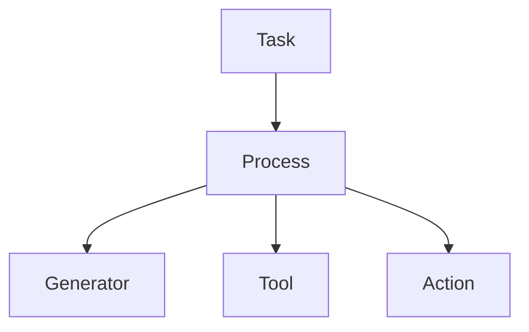

# 第五章：控制权与裁决模型

本章将阐述 **Mindloom 系统中的控制权与执行裁决模型**。

**Mindloom** 的执行系统采用 **调度器控制结构**，在该结构中执行流程由 **调度器节点** 控制，而执行结果由 **调度器** 逐层解释与裁决。

## 5.1 执行角色与控制权

在 **Mindloom** 的执行体系中，执行节点根据职责被划分为两种角色：

* **调度器（Scheduler）**
* **执行器（Executor）**

**调度器** 负责组织执行流程，并决定系统的下一步行为。
**执行器** 负责完成具体任务，并返回执行结果。

在执行过程中，系统遵循以下控制原则：

* 控制权始终存在于 **调度器节点**
* **执行器节点** 不会获得控制权
* **执行结果** 由调度器节点解释与处理

因此，在 **Mindloom** 中：

> **执行器永远不会控制程序的执行流程。**

执行器只负责完成任务，而执行流程的组织与控制始终由调度器节点决定。

## 5.2 控制权转移规则

在 **Mindloom** 中，**CALL** 是唯一的执行跃迁机制。

当调度器节点执行 **CALL** 时，会创建新的执行节点。
控制权是否发生转移取决于 **CALL** 的目标类型。

系统采用以下规则：

* 当 **CALL** 的目标是 **Process 单元** 时，控制权转移到新的流程节点
* 当 **CALL** 的目标是 **Executor 单元** 时，控制权保持在当前调度器节点

因此，控制权只会在 **调度器节点之间转移**，而不会转移到执行器节点。

下图展示了 **Mindloom** 的执行控制结构。

在该结构中：

* **Task 与 Process 为调度器节点**
* **Generator、Tool、Action 为执行器节点**

执行器节点负责完成任务，但不会改变执行结构或控制流程。

## 5.3 执行结果裁决

当执行节点完成任务后，会返回 **执行结果（Execution Result）**。
系统需要根据该结果决定下一步行为，这一过程称为 **执行裁决（Arbitration）**。

执行结果通常包含两种状态：

* **success** 节点执行成功，返回输出参数
* **failure** 节点执行失败，返回错误信息

在 **Mindloom** 中：

> **错误不是异常事件，而是执行结果的一种类型。**

调度器节点会根据执行结果决定后续流程。

### 5.3.1 成功结果处理

当执行结果为 **success** 时，调度器节点会根据 **CALL** 定义的输出映射规则，将返回的输出参数写入当前节点的 **数据域**。

完成参数写入后，流程继续按照既定结构执行后续步骤。

因此，成功结果的处理通常包括两个步骤：

* 输出参数写入节点数据域
* 继续执行后续流程

### 5.3.2 错误处理策略

当执行结果为 **failure** 时，调度器节点需要决定如何处理该错误。

**Process 节点** 可以在 **CALL** 定义中声明错误处理策略。

如果 **CALL** 未声明错误处理策略，则系统采用默认行为：

* **propagate**（向上传播）

该行为表示当前节点不处理该错误，而是将执行结果返回给父节点。

如果 **CALL** 声明了错误处理策略，则属于 **错误处置（Error Handling）**。

当前版本的 **Mindloom** 支持以下 **错误处置** 策略：

- **retry** 重新执行该 **CALL**
- **ignore** 忽略错误并继续执行流程
- **default** 使用预定义的默认输出继续执行流程

通过这些策略，**Process 节点** 可以在流程层面对执行错误进行灵活处理。

## 5.4 执行结果传播

执行结果沿 **CALL 调用链** 向上传播。

当执行节点返回 **failure** 且当前 **CALL** 未声明错误处理策略时，系统会采用 **propagate** 行为：

* 当前 **Process 节点** 立即结束执行
* 错误结果返回到调用它的父节点

父节点接收到错误结果后，可以再次进行裁决：

* 定义错误处理策略，对错误进行处置
* 继续使用 **propagate** 将错误向上传播

如果错误持续向上传播，最终会到达 **Task 节点**。
此时，Task 节点将决定 **Agent** 的最终执行结果。

这一机制对应 **Mindloom** 的语义原则：

> **错误必须被某一层裁决。**

### 5.4.1 并行场景中错误传播

在并行执行场景中，错误传播遵循相同规则。

当 **Process** 同时发起多个 **CALL** 时，如果其中某个 **CALL** 返回 **failure** 且策略为 **propagate**，系统将按以下原则处理：

* 当前 **Process 节点** 立即终止执行
* 其余仍在运行的并行节点会被终止
* 错误结果向上传播

因此，并行执行不会改变错误传播路径。

### 5.4.2 结果传播中语义组件定位

整体来看，执行结果传播机制可以总结为：

* **执行器** 只产生执行结果
* **Process** 可以裁决结果，也可以选择 **向上传播**
* **Task** 决定 **Agent** 的最终执行结果

通过这种传播机制：

* 执行路径与结果路径保持一致
* 每个执行结果都可以被追踪
* 每个执行结果最终都会被裁决

从而保证执行结构的稳定性，同时允许流程层定义灵活的错误处理策略。
