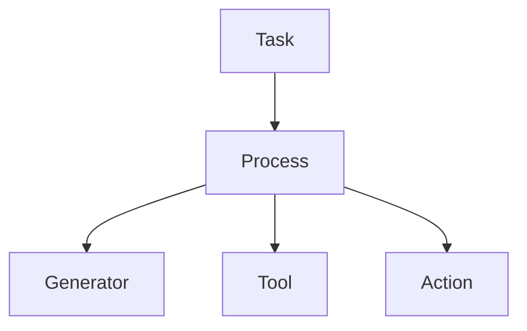

# 第五章：控制权与裁决模型

本章将阐述 **Mindloom 系统中的控制权与执行裁决模型**。

**Mindloom** 的执行系统采用 **调度器控制结构**，在该结构中执行流程由 **调度器节点** 控制，而执行结果由 **调度器** 逐层解释与裁决。

## 5.1 控制模型概述

**Mindloom** 的执行系统采用 **调度器控制模型**。

在该模型中，系统将执行单元划分为两种角色：

* **调度器（Scheduler）**
* **执行器（Executor）**

**调度器** 负责组织执行流程，而 **执行器** 负责完成具体任务。

**Mindloom** 的执行控制遵循以下原则：

* 控制权始终存在于 **调度器节点** 中
* **执行器节点** 不会获得控制权
* **调度器节点** 负责解释执行结果

在 Mindloom 中：

> **执行器永远不会控制程序。**

这种设计保证执行流程不会被任务执行逻辑改变，从而保持系统行为的一致性与稳定性。

## 5.2 调度器与执行器

在 **Mindloom** 中，执行单元根据职责被划分为两类。

### 5.2.1 调度器（Scheduler）

**调度器** （ **Task** 、 **Process** ）负责组织执行流程。

**调度器**节点具有以下能力：

* 发起 **CALL**
* 决定执行路径
* 解释子节点执行结果
* 决定流程是否继续

调度器节点是执行结构中的 **控制节点**。

### 5.2.2 执行器（Executor）

**执行器**（ **Generator** 、**Tool** 、 **Action**）负责完成具体任务。

执行器节点的职责包括：

* 接收输入参数
* 执行具体任务
* 返回结构化执行结果

执行器节点不会：

* 控制执行流程
* 发起 **CALL**
* 裁决执行结果

执行器的行为可以抽象为：

```
inputs → execution → outputs
```

执行器只负责完成任务，而不会改变系统的执行结构。

## 5.3 控制权转移规则

当 **调度器节点** 执行 **CALL** 时，会创建新的**执行节点**。

**CALL 是唯一的执行跃迁机制**，但控制权是否发生转移取决于 **CALL** 的目标类型。

**Mindloom** 采用以下规则：

* 当 CALL 的目标是 **Process 单元** 时，控制权转移到新的**流程节点**
* 当 CALL 的目标是 **Executor 单元** 时，控制权保持在当前**调度器节点**

控制权只会在 **调度器节点** 之间转移，而不会转移到 **执行器节点** 。

下图展示了 **Mindloom** 的执行控制结构。



在该结构中：

* **Task 与 Process 为调度器节点**
* **Generator、Tool、Action 为执行器节点**

执行器节点负责完成任务，但不会改变执行结构。

## 5.4 执行结果裁决

当执行节点完成任务后，会返回 **执行结果** ，系统需要决定如何处理该结果，这一过程称为 **执行裁决（Arbitration）**。

**执行结果** 状态包括：

* **success** 节点执行成功，返回 **输出参数**
* **failure** 节点执行失败，返回 **错误记录**

在 **Mindloom** 中：

> **错误不是异常事件，而是执行结果的一种类型**。

不同层级的执行单元承担不同职责：

* **Executor** 产生执行结果 
* **Process** 根据 **CALL** 定义解释执行结果
* **Task** 对 **Agent** 的最终结果进行裁决

通过这种分层裁决机制，系统能够在保持执行结构稳定的前提下处理复杂执行情况。

## 5.5 错误传播模型

在 **Mindloom**，节点执行过程中产生错误，会立即停止执行，作为执行的失败结果向父节点返回 **错误记录**。

错误可沿 **CALL 调用链** 向上传播，且错误可以被某一层 **Process 节点** 裁决，也可以一直向上返回到 **Task节点**。

调度器节点可以解释子节点结果，例如：

* 重试执行
* 忽略错误
* 使用默认输出

**规则三**

如果调度器未对结果进行处理，该结果会继续向上传播。

最终，执行结果会返回到 **Task 节点**，由 **Task** 决定 **Agent** 的最终执行状态。

通过这种结果传播机制，Mindloom 保证：

* 执行路径与结果路径保持一致
* 每个执行结果都可以被追踪
* 每个执行结果最终都会被裁决

通过 **调度器控制流程、执行器完成任务、结果逐层裁决** 的设计，Mindloom 构建了一种结构清晰且可预测的执行体系。
