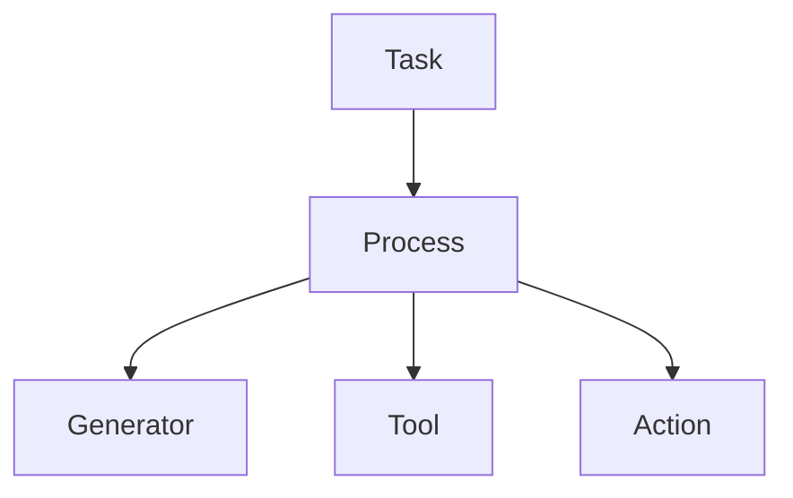

# 第五章：控制权与裁决模型

本章将阐述 **Mindloom 系统中的控制权与执行裁决模型**。

**Mindloom** 的执行系统采用 **调度器控制结构**，在该结构中执行流程由 **调度器节点** 控制，而执行结果由 **调度器** 逐层解释与裁决。

## 5.1 控制模型概述

**Mindloom** 的执行系统采用 **调度器控制模型**。

在该模型中，系统将执行单元划分为两种角色：

* **调度器（Scheduler）**
* **执行器（Executor）**

**调度器** 负责组织执行流程，而 **执行器** 负责完成具体任务。

**Mindloom** 的执行控制遵循以下原则：

* 控制权始终存在于 **调度器节点** 中
* **执行器节点** 不会获得控制权
* **调度器节点** 负责解释执行结果

在 Mindloom 中：

> **执行器永远不会控制程序。**

这种设计保证执行流程不会被任务执行逻辑改变，从而保持系统行为的一致性与稳定性。

## 5.2 调度器与执行器

在 **Mindloom** 中，执行单元根据职责被划分为两类。

### 5.2.1 调度器（Scheduler）

**调度器** （ **Task** 、 **Process** ）负责组织执行流程。

**调度器**节点具有以下能力：

* 发起 **CALL**
* 决定执行路径
* 解释子节点执行结果
* 决定流程是否继续

调度器节点是执行结构中的 **控制节点**。

### 5.2.2 执行器（Executor）

**执行器**（ **Generator** 、**Tool** 、 **Action**）负责完成具体任务。

执行器节点的职责包括：

* 接收输入参数
* 执行具体任务
* 返回结构化执行结果

执行器节点不会：

* 控制执行流程
* 发起 **CALL**
* 裁决执行结果

执行器只负责完成任务，而不会改变系统的执行结构。

## 5.3 控制权转移规则

当 **调度器节点** 执行 **CALL** 时，会创建新的**执行节点**。

**CALL 是唯一的执行跃迁机制**，但控制权是否发生转移取决于 **CALL** 的目标类型。

**Mindloom** 采用以下规则：

* 当 CALL 的目标是 **Process 单元** 时，控制权转移到新的**流程节点**
* 当 CALL 的目标是 **Executor 单元** 时，控制权保持在当前**调度器节点**

控制权只会在 **调度器节点** 之间转移，而不会转移到 **执行器节点** 。

下图展示了 **Mindloom** 的执行控制结构。

在该结构中：

* **Task 与 Process 为调度器节点**
* **Generator、Tool、Action 为执行器节点**

执行器节点负责完成任务，但不会改变执行结构。

## 5.4 执行结果的裁决

当执行节点完成任务后，会返回 **执行结果** ，系统需要决定如何处理该结果，这一过程称为 **执行裁决（Arbitration）**。

**执行结果** 状态包括：

* **success** 节点执行成功，返回 **输出参数**
* **failure** 节点执行失败，返回 **错误记录**

当执行结果为 **success** 时，调度器节点会根据 **CALL** 定义的输出映射，将返回的输出参数写入当前节点的 **数据域** ，并继续执行后续流程。

在 **Mindloom** 中：

> **错误不是异常事件，而是执行结果的一种类型**。

当执行结果为 **failure** 时，**Process 节点** 根据在 **Process 单元** 的 **CALL** 中是否定义错误处理策略选择处置方式：

* 如果 **CALL** 未定义错误处理策略，则采用默认策略 **向上传播 （propagate）** ，该策略表示当前节点不处理该错误，而是将错误转交给父节点。
* 如果 **CALL** 定义了错误处理策略，则属于 **错误处置（Error Handling）**。

当前版本的 **Mindloom** 支持以下 **错误处置** 策略：

- **retry** 重新执行该 **CALL**
- **ignore** 忽略错误并继续执行流程
- **default** 使用预定义的默认输出继续执行流程

通过这些策略，**Process 节点** 可以在流程层面对执行错误进行灵活处理。

## 5.5 执行结果的传播

执行结果沿 **CALL** 调用链 **向上传播**。

当执行节点返回 **failure** 且当前 **CALL** 未定义错误处理策略时，系统会采用 **propagate** 行为：

- 当前 **Process 节点** 立即结束执行
- 错误结果返回到调用它的父节点

父节点接收到错误结果后，可以再次进行裁决：

- 定义错误处理策略，对错误进行处置
- 继续使用 **propagate** 将错误向上传播

如果错误持续向上传播，最终会到达 Task 节点。此时，Task 节点将决定 **Agent** 的最终执行结果。

这一机制对应 **Mindloom** 的语义原则：

> **错误必须被某一层裁决。**

特别强调，在并行执行场景中，错误传播遵循相同规则。
当并行 **Process** 同时发起多个 CALL 时，如果其中某个 **CALL** 返回 **failure** 且策略为 **propagate**，处置原则如下：

- 当前 **Process 节点** 会立即终止执行
- 其余仍在运行的并行节点会被强制结束
- 错误结果 **向上传播**

因此，并行执行不会改变错误传播路径。

整体来看，执行结果传播机制可以总结为：

* **执行器** 只产生执行结果
* **Process** 可以裁决结果，可以 **向上传播**
* **Task** 决定 **Agent** 的最终执行结果

通过这种传播机制：

* 执行路径与结果路径保持一致
* 每个执行结果都可以被追踪
* 每个执行结果最终都会被裁决

通过这种方式，Mindloom 保持了执行结构的稳定性，同时允许灵活的错误处理策略。
