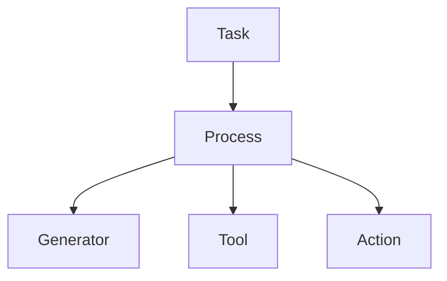

# 第五章：执行控制模型

本章将阐述 **Mindloom 的执行控制模型**。

该模型用于描述在任务执行过程中：

* 执行流程如何被调度
* 控制权如何在节点之间转移
* 执行结果如何在系统中被解释与裁决

Mindloom 采用 **调度器控制模型（Scheduler Control Model）**。

在该模型中：

* 执行流程由调度器节点控制
* 执行器节点只负责完成具体任务
* 执行结果由调度器逐层解释与裁决

通过这种设计，Mindloom 能够保证执行流程始终 **可追踪、可理解且可预测**。

---

# 5.1 控制模型概述

Mindloom 的执行系统采用 **调度器控制模型**。

在该模型中，系统将执行单元划分为两种角色：

* **调度器（Scheduler）**
* **执行器（Executor）**

调度器负责组织执行流程，而执行器负责完成具体任务。

Mindloom 的执行控制遵循以下原则：

* 控制权始终存在于调度器节点中
* 执行器节点不会获得控制权
* 调度器节点负责解释执行结果

因此，在 Mindloom 中：

> **Executor 永远不会控制程序。**

这种设计保证执行流程不会被任务执行逻辑改变，从而保持系统行为的一致性与稳定性。

---

# 5.2 调度器与执行器

在 Mindloom 中，执行单元根据职责被划分为两类。

## 调度器（Scheduler）

调度器负责组织执行流程。

Mindloom 中的调度器包括：

* **Task**
* **Process**

调度器节点具有以下能力：

* 发起 CALL
* 决定执行路径
* 解释子节点执行结果
* 决定流程是否继续

调度器节点是执行结构中的 **控制节点**。

---

## 执行器（Executor）

执行器负责完成具体任务。

Mindloom 中的执行器包括：

* **Generator**
* **Tool**
* **Action**

执行器节点的职责包括：

* 接收输入参数
* 执行具体任务
* 返回结构化执行结果

执行器节点不会：

* 控制执行流程
* 发起 CALL
* 裁决执行结果

执行器的行为可以抽象为：

```
inputs → execution → outputs
```

执行器只负责完成任务，而不会改变系统的执行结构。

---

# 5.3 控制权转移规则

在 Mindloom 中，**CALL 是唯一的执行跃迁机制**。

当调度器节点执行 CALL 时，会创建新的执行节点。

控制权是否发生转移取决于 CALL 的目标类型。

Mindloom 采用以下规则：

* 当 CALL 的目标是 **Process 单元** 时，控制权转移到新的流程节点
* 当 CALL 的目标是 **Executor 单元** 时，控制权保持在当前调度器节点

因此，控制权的变化可以表示为：

```
Scheduler → Process      控制权转移
Scheduler → Executor     控制权保持
```

控制权只会在调度器节点之间转移，而不会转移到执行器节点。

下图展示了 Mindloom 的执行控制结构。



在该结构中：

* **Task 与 Process 为调度器节点**
* **Generator、Tool、Action 为执行器节点**

执行器节点负责完成任务，但不会改变执行结构。

---

# 5.4 执行结果裁决

当执行节点完成任务后，会返回 **执行结果（Execution Result）**。

执行结果描述节点的执行状态。

常见状态包括：

* **success**
* **failure**

在 Mindloom 中：

> 错误被视为执行结果的一种形式。

执行失败不会破坏执行结构，而是由调度器节点进行解释与裁决。

执行结果的处理遵循以下原则：

* **Executor 只产生执行结果**
* **Process 解释执行结果**
* **Task 决定 Agent 的最终执行结果**

通过这种分层裁决机制，系统能够在保持执行结构稳定的前提下处理复杂执行情况。

---

# 5.5 执行结果传播

执行结果沿 **CALL 调用链** 向上传播。

其传播过程遵循以下规则：

**规则一**

子节点执行结束后，其执行结果会返回到发起 CALL 的父节点。

**规则二**

调度器节点可以解释子节点结果，例如：

* 重试执行
* 忽略错误
* 使用默认输出

**规则三**

如果调度器未对结果进行处理，该结果会继续向上传播。

最终，执行结果会返回到 **Task 节点**，由 Task 决定 Agent 的最终执行状态。

通过这种结果传播机制，Mindloom 保证：

* 执行路径与结果路径保持一致
* 每个执行结果都可以被追踪
* 每个执行结果最终都会被裁决

---

本章定义了 Mindloom 的执行控制模型。

通过 **调度器控制流程、执行器完成任务、结果逐层裁决** 的设计，Mindloom 构建了一种结构清晰且可预测的执行体系。
