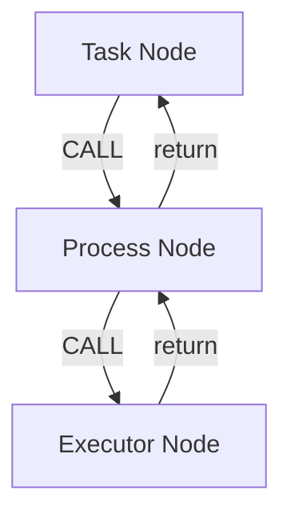
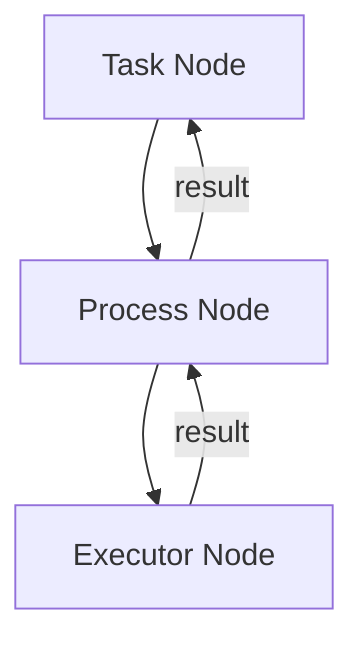

# 第五章：控制权与裁决模型

在 Mindloom 的执行体系中，**控制权（Control Authority）** 与 **执行裁决（Execution Arbitration）** 是保证系统可预测性的重要语义机制。

执行模型决定 **执行如何发生**，而控制模型决定 **执行如何被组织与管理**。

本章将定义 Mindloom 的控制语义，包括：

* 控制权在执行结构中的存在方式
* 控制权在执行过程中的转移机制
* 执行结果在系统中的裁决与传播规则

通过这些规则，Mindloom 在保持执行结构简单的同时，能够构建可理解、可追踪且可预测的复杂 Agent 行为。

---

# 5.1 控制权模型（Control Authority）

在 Mindloom 中，**控制权始终显式存在于某一个执行节点中**。

控制权表示：

> 当前节点拥有决定下一步执行行为的能力。

在任意时刻：

* 系统只存在 **一个正在执行的节点**
* 该节点持有当前执行的 **控制权**

只有持有控制权的节点，才可以：

* 决定是否发起新的 **CALL**
* 决定调用哪个执行单元
* 解释执行结果并继续流程

Mindloom 将所有执行单元划分为两种角色：

* **调度器（Scheduler）**
* **执行器（Executor）**

这种角色划分同时决定了控制权的归属。

| 执行单元类型       | 控制权    | 语义职责       |
| ------------ | ------ | ---------- |
| **Task**     | 根控制权   | Agent 执行入口 |
| **Process**  | 流程控制权  | 组织执行流程     |
| **Executor** | 不拥有控制权 | 执行具体任务     |

因此：

* **Task 与 Process** 负责控制执行结构
* **Executor** 只负责执行任务并返回结果

Executor 的执行语义是一个封闭行为：

```
inputs → execution → outputs
```

执行器：

* 不决定流程路径
* 不发起 CALL
* 不解释执行结果

所有流程控制逻辑都由 **Scheduler 层**完成。

这种设计保证了执行结构的清晰性，使系统行为始终可推理。

---

# 5.2 控制权转移机制

在 Mindloom 中，**CALL 是唯一的控制权转移机制**。

当一个节点发起 **CALL** 时，会发生以下语义变化：

1. 引擎根据模板创建新的执行节点
2. 控制权从父节点转移到子节点
3. 子节点执行其生命周期
4. 子节点结束后返回执行结果
5. 控制权返回父节点

因此，CALL 同时具有两种语义：

* **执行跃迁**
* **控制权转移**

在执行过程中，节点之间形成明确的父子关系，并构成一棵执行树。

### 控制权转移示意



在该结构中：

* 控制权从 **Task → Process → Executor** 逐层传递
* 子节点结束后控制权返回父节点

这种严格的控制权转移规则，使执行路径始终可追踪。

---

# 5.3 执行结果语义

在 Mindloom 中，所有执行节点都会产生 **结构化执行结果（Execution Result）**。

执行结果是节点生命周期结束后返回的数据结构，其结构必须符合模板定义的输出契约。

执行结果通常包含两种状态：

| 状态          | 含义     |
| ----------- | ------ |
| **success** | 节点执行成功 |
| **failure** | 节点执行失败 |

需要特别强调：

> 在 Mindloom 中，**错误不是异常事件，而是执行结果的一种类型**。

因此：

* 执行失败不会破坏执行结构
* 所有错误都以结构化结果形式返回
* 调度器负责解释这些结果

这种设计使系统能够保持统一的执行语义。

---

# 5.4 执行裁决模型（Execution Arbitration）

当一个节点返回执行结果后，系统需要决定如何处理该结果，这一过程称为 **执行裁决（Arbitration）**。

不同层级的执行单元承担不同职责：

| 层级           | 职责                |
| ------------ | ----------------- |
| **Executor** | 产生执行结果            |
| **Process**  | 根据 CALL 定义解释执行结果  |
| **Task**     | 对 Agent 的最终结果进行裁决 |

执行器只负责完成任务并返回结果，不参与任何裁决行为。

Process 负责解释子节点的执行结果，例如：

* 是否继续执行流程
* 是否执行重试
* 是否使用默认值

Task 是执行结构的根节点，负责对 Agent 的最终执行状态进行裁决。

这种职责划分使得：

* 执行单元保持简单
* 控制逻辑集中在调度层
* 执行行为保持可预测

---

# 5.5 执行结果传播规则

在 Mindloom 中，执行结果沿 **CALL 调用链向上传播**。

其基本规则如下：

**规则一：结果从子节点返回父节点**

子节点结束后，其执行结果会返回发起 CALL 的节点。

**规则二：调度器可以解释执行结果**

Process 可以根据 CALL 定义的策略解释执行结果，例如：

* 重试
* 忽略错误
* 使用默认输出

**规则三：未被解释的结果继续向上传播**

如果 Process 未处理该结果，则该结果会继续向上传播，最终到达 Task。

### 执行结果传播示意



这种传播模型与执行树结构完全一致，使执行路径与结果路径保持一致。

---

# 5.6 并行执行中的裁决

在并行流程中，Process 可以同时发起多个 **CALL**。

每个 CALL 会产生独立的执行结果，并在节点结束后返回。

当执行失败时，Process 会根据 **CALL 定义的策略**决定如何处理该结果。

常见策略包括：

| 策略            | 行为         |
| ------------- | ---------- |
| **propagate** | 将错误向上传播    |
| **retry**     | 重新执行该 CALL |
| **ignore**    | 忽略错误继续流程   |
| **default**   | 使用默认输出     |

需要强调：

> **错误处理策略属于 CALL，而不是节点。**

同一个 Process 中的不同 CALL 可以拥有不同策略，例如：

```
Process
 ├─ call A (retry)
 ├─ call B (ignore)
 └─ call C (propagate)
```

这种设计使流程能够针对不同执行单元采用不同的容错策略。

当某个 CALL 的策略为 **propagate** 时：

* 当前 Process 结束执行
* 错误返回父节点
* 父节点继续执行裁决逻辑

通过这种方式，Mindloom 保持了执行结构的稳定性，同时允许灵活的错误处理策略。
