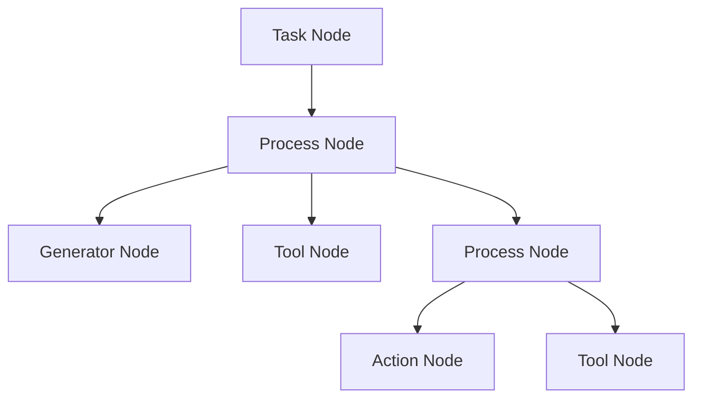
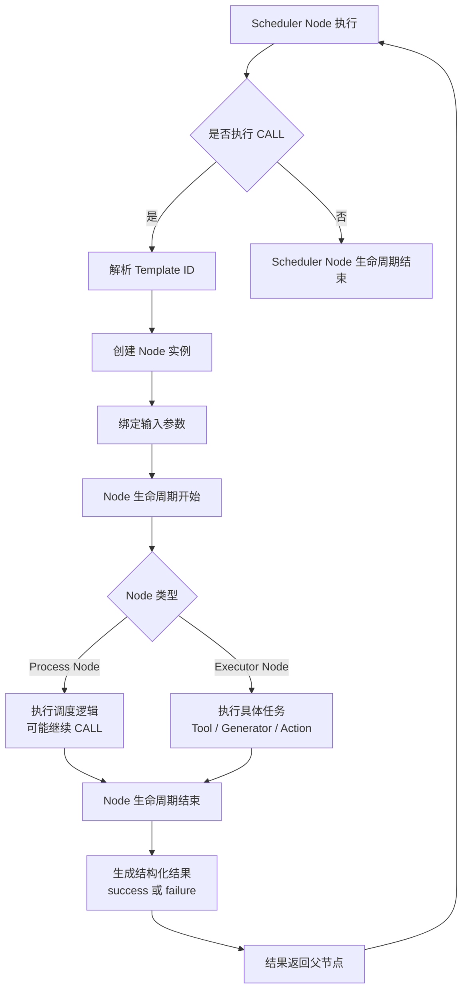

# 第四章：执行跃迁模型

本章将描述 **Mindloom 的执行机制**，即系统在运行时如何从一个执行状态跃迁到另一个执行状态，以及各执行单元之间如何通过 **CALL** 形成完整的执行过程。

Mindloom 的运行过程可以抽象为一个逐步展开并最终收敛的执行结构。系统从 **Task 节点** 启动，在执行过程中不断创建新的执行节点，并在节点生命周期结束后返回结果。随着执行的推进，系统逐步形成一棵完整的执行结构，并最终收敛到任务节点的结束。

Mindloom 的运行时结构可以理解为一种 **树形执行系统**。每个执行步骤都对应一个节点，节点之间通过 **CALL** 建立父子关系，从而形成清晰的执行层级。

## 4.1 执行结构

在 Mindloom 中，**执行节点（Node）** 是运行时的基本执行单位。每当系统执行一个单元时，引擎都会创建一个对应的节点实例，并为该节点分配唯一的运行标识和独立的执行上下文环境。

节点之间通过 **CALL** 建立父子关系。当一个节点调用另一个单元时，引擎会加载目标单元并创建新的节点实例。调用方节点成为父节点，被调用节点成为子节点。

随着执行不断展开，系统会逐渐形成一棵 **执行树结构（Execution Tree）**。
在这棵树中：

* 每个节点都有唯一的父节点（Task 节点除外）
* 子节点执行完成后，其结果会返回给父节点
* 父节点根据返回结果继续执行后续逻辑

通过这种结构，整个执行过程始终保持清晰的层级关系，并且所有执行路径都可以从任务节点进行追溯。

在 Mindloom 中，**Task 节点是整个执行结构的入口节点**。

每一次 **Agent** 运行时，引擎会首先加载任务单元，并创建唯一的 **Task Node**。该节点由引擎直接启动，而不是通过 **CALL** 创建。因此，在一次执行过程中始终只存在 **一个 Task 节点**。

Task 节点构成执行树的根节点，并负责启动整个执行流程。通常情况下，Task 节点内部会定义一个主 **CALL**，用于触发后续的执行流程。

通过这种结构，Mindloom 的执行路径始终保持清晰可追踪，并且所有执行流程最终都会收敛到任务节点的结束。

## 4.2 执行跃迁

在 Mindloom 中，**执行跃迁（Execution Transition）** 指系统从一个执行节点转移到另一个执行节点的过程。

Mindloom 只允许通过 **CALL** 进行执行跃迁。

当一个节点执行 **CALL** 时，引擎会根据调用定义解析目标模板，并加载对应的单元。随后系统会创建新的执行节点，并将该节点加入当前执行结构中。新节点开始执行其自身逻辑，而父节点会等待子节点执行完成后再继续执行。

因此，在 Mindloom 中：

> **CALL 是唯一的执行跃迁机制。**

这种设计避免了任意跳转或不受约束的流程控制，使执行结构始终保持清晰和可预测。执行流程只能通过节点之间的调用关系展开，而不会形成复杂的图结构或不可追踪的执行路径。

从语义上看，Mindloom 的 **CALL** 与传统编程语言中的函数调用存在相似之处，但其语义更接近于：

> **创建一个新的执行节点，并等待该节点生命周期结束。**

通过这一机制，系统能够在运行过程中逐步构建完整的执行结构，并在节点结束后逐层返回结果。

## 4.3 CALL 的执行生命周期

当节点执行 **CALL** 时，引擎会按照固定的执行流程创建并运行新的节点。
这一过程构成了 **CALL 的执行生命周期**。

CALL 的执行通常包含以下阶段：

1. **模板解析**

   调度器节点根据 **CALL** 定义解析目标模板 ID，并加载对应的单元定义。

2. **节点创建**

   引擎根据单元定义实例化新的节点。系统会为该节点分配唯一的运行标识（Node ID），用于标识此次执行生命周期。

3. **参数绑定**

   调用节点将输入参数传递给新节点。参数以值复制的方式进入子节点的数据域，子节点对数据的修改不会影响父节点。

4. **节点执行**

   新节点开始执行其自身逻辑。
   如果节点为 **执行器节点**，则直接执行对应任务并生成结果；如果节点为 **调度器节点**，则可能继续发起新的 **CALL**。

5. **生命周期结束**

   节点执行完成后结束其生命周期，并生成执行结果。执行结果必须符合模板定义的输出结构。

6. **结果返回**

   执行结果返回给发起 **CALL** 的父节点，由父节点根据自身调度逻辑决定后续执行流程。

在整个过程中，父节点会等待子节点执行结束。对于并行流程节点，父节点可以同时发起多个 **CALL**，并在所有子节点完成后继续执行。

通过这一生命周期模型，Mindloom 保证了每个执行节点都具有明确的开始与结束，并且执行结果能够沿调用路径逐层返回。

## 4.4 Task 与 Process 节点

在 **Mindloom** 的执行结构中，**Task 节点** 与 **Process 节点** 都属于 **调度器节点** ，它们负责组织执行流程。

**Task 节点** 是执行结构的入口节点，由引擎启动创建，并作为整个执行树的根节点。 **Task 节点** 通常只承担启动流程的职责，通过一个或多个 **CALL** 触发后续执行单元。

**Process 节点** 是执行流程的核心调度节点。与 **Task 节点** 不同，**Process 节点** 是在运行过程中通过 **CALL** 创建的，并在执行过程中承担主要的流程控制职责。

Process 节点可以根据模板定义发起多个 **CALL**，从而生成新的执行节点。这些节点可以是：

* **Process 节点**
* **Generator 节点**
* **Tool 节点**
* **Action 节点**

不同类型的 **Process** 可以定义不同的调度策略，例如顺序执行、条件分支、循环执行或并行执行等。具体的流程控制语义将在后续章节中进一步说明。

通过 **Task 节点** 与 **Process 节点** 的协同作用，**Mindloom** 构建出完整的执行结构，并保证整个执行过程始终保持结构化与可追踪。
