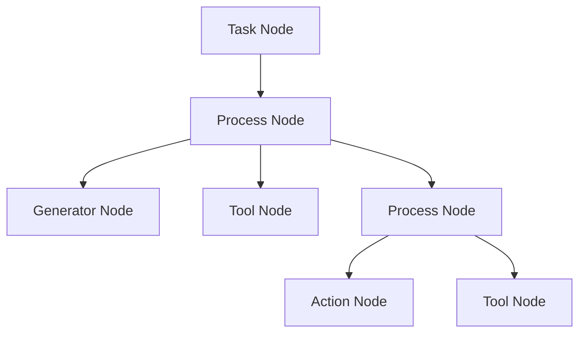
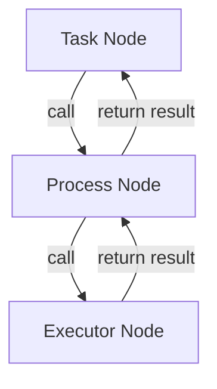
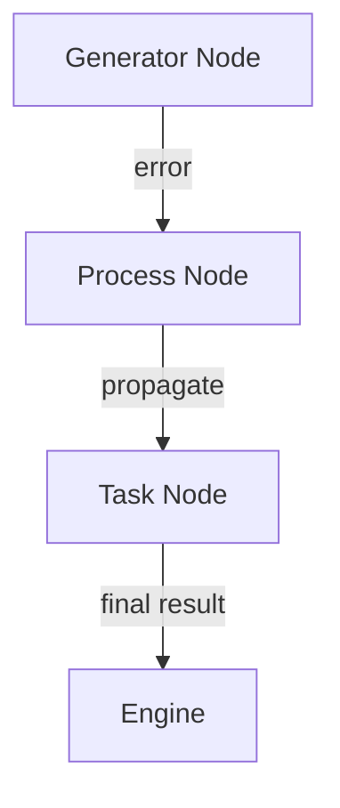
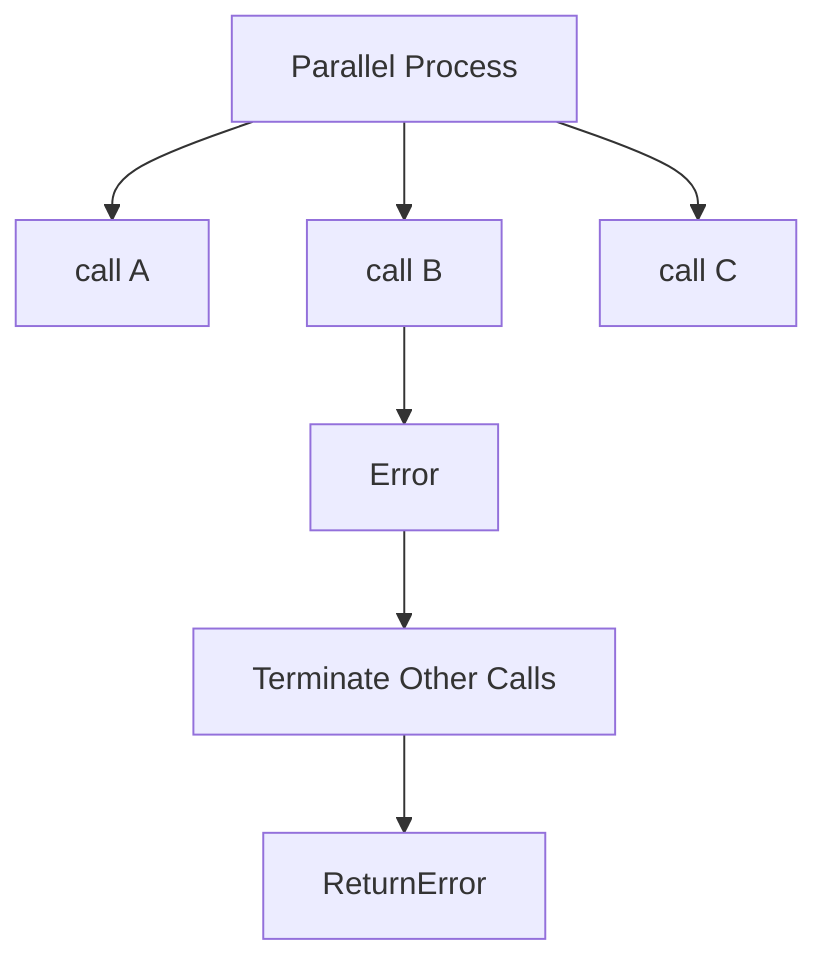
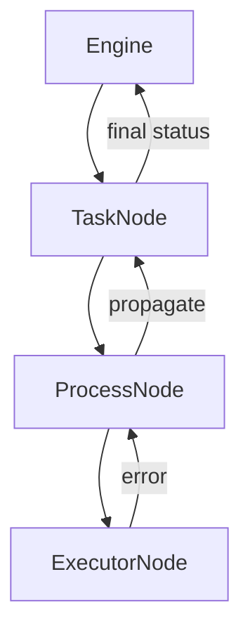
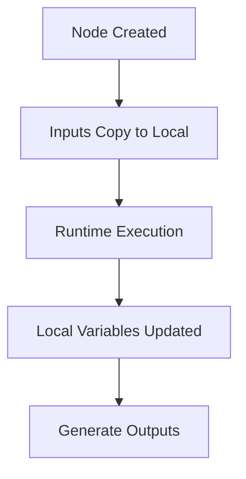
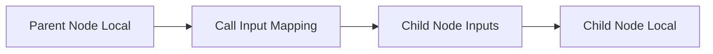
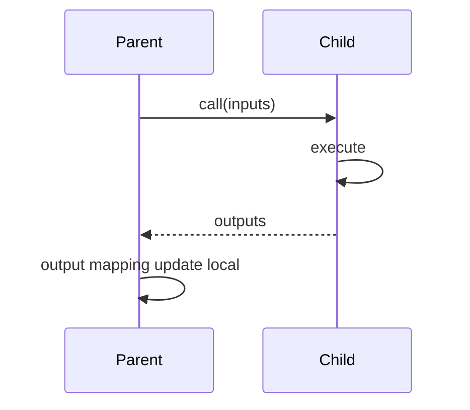
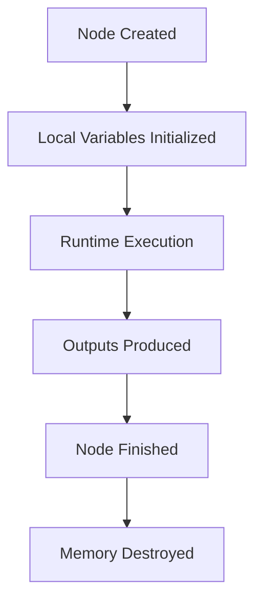
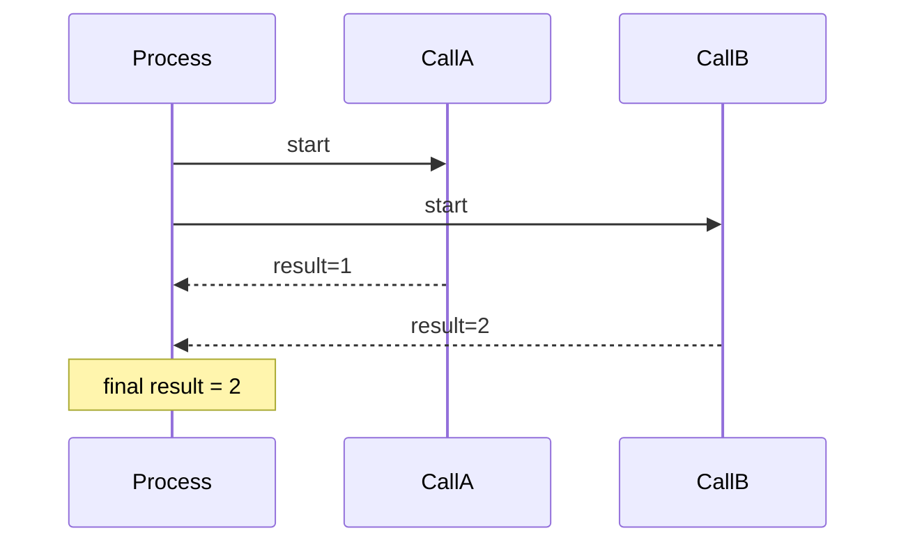

# mindloom 语义规范（v0.2）

# 第一章：语言定位与设计哲学

## 1.1 Mindloom 的本体

**Mindloom** 是一种基于自然语言的编程语言，它的设计目的是让编程人员通过结构化语言与自然语言表达 AI 的执行任务和逻辑控制，而非传统的编程方式。它与传统的 Agent 系统、调度器或虚拟机不同。传统的 Agent 系统通常是利用 AI LLM 执行特定任务的应用，结合代码、计算机服务器、硬件设备以及决策系统，形成完整的应用。而 Mindloom 则是为编程人员提供的一个编程框架，通过语言和结构化参数表达，这种设计允许编程人员通过结构化的语言逻辑描述任意 Agent 的行为，而不需要深入学习计算机编程语言本身。

在传统编程中，开发者需要学习特定的编程语言和环境。Mindloom 摒弃了这一技术门槛，使用自然语言描述逻辑，并通过结构化模板来管理任务和流程的执行。这种方式让没有编程基础但具备特定领域知识、业务背景和逻辑思维能力的人，如提示工程师和业务专家，也能参与到 AI 的编程过程中，从而使编程更具包容性和普适性。在最新的 AI LLM 技术加持下，编程将更聚焦其原始的定义——**一个逻辑设计与表达的过程**，而不是一个技术性高度依赖特定编程语言的活动。

## 1.2 Mindloom 作为自然语言编程的表达工具

Mindloom 提供了一种新型的编程模式，模板是 Mindloom 中的核心载体，负责表达编程逻辑和提示工程师的设计思想。它通过结构化的语言定义了系统的执行规则、数据流动和任务控制等内容。提示工程师通过自然语言的方式设计系统的结构，并将这些设计转换为易于理解和执行的模板。模板的设计与传统代码的结构类似，但在 Mindloom 中，它更注重于逻辑的表达和系统行为的定义，而不依赖于特定编程语言的语法。

这些模板通常使用 JSON 格式进行存储，可以通过文件系统或数据库进行管理。通过模板，提示工程师可以设计任务的执行流程、数据的输入与输出、错误处理机制等。Mindloom 引擎在运行时会加载这些模板，并根据其定义的结构执行相应的任务。每个模板都定义了明确的执行契约，包括输入输出项、执行流程的顺序、参数的验证、执行结果的结构等，确保了任务的可控性和可预测性。

通过这种方式，Mindloom 实现了自然语言编程与结构化模板的结合，使得复杂的执行逻辑能够通过简洁的表达方式设计，并且可以通过引擎加载后执行，最终结合外部操作形成一个完整的 Agent。

## 1.3 Mindloom 的设计哲学

Mindloom 的设计哲学基于对 AI LLM 能力的理解。AI LLM 可以处理低脑力、简单的决策任务，但它的智能和控制力是有限的，不能替代人类在高层次、核心决策中的作用。因此，Mindloom 的设计不依赖 AI 的完全决策，而是将高层决策和核心控制交给人类，仅允许末端决策交给 AI。高层的决策仍依赖并信任提示工程师、业务专家及最终用户的设计。因此，Mindloom 的设计哲学是 **强约束的限制性语义**。

### 1.3.1 限制 AI 的完全决策能力

Mindloom 避免将完全的决策能力交给 AI。AI LLM 在完全自主决策时，可能产生不可预期的结果，这可能导致混乱或难以理解的错误。Mindloom 通过明确的逻辑控制结构和预定义的流程，确保所有决策过程都能由人类设计和管理，从而保持系统的可预测性。每个执行单元都严格定义了其输入、输出和执行逻辑，避免了 AI 在执行过程中做出不符合预期的决策。

### 1.3.2 牺牲自由度换取可控性

Mindloom 的设计放弃了编程中的某些自由度，旨在获得更高的可控性和可预测性。在执行过程中，系统中的每个步骤都是闭包的，执行逻辑必须经过精心设计和预定义，其结果都是可以预知的。具体来说，每个步骤通过调用 `call` 执行与结束，每个调用执行完毕后，返回到上层的调用，直到最外层的执行完毕，整个任务才会结束。运行逻辑可以理解为迭代调用或递归调用，类似数据结构中的压栈和出栈。系统的结构化和控制流的明确，使得每个执行节点都有一个确定的起点和终点，防止了系统陷入无法预期的行为。

和传统的基于 `next` 指针的 AI Agent 编程框架、工作流编排软件不同，Mindloom 的设计是**基于调用 `call` 的**。这样的设计避免了任意跳转、回跳等不确定的控制结构，也避免了复杂的图结构设计，例如需要全局节点关联关系检测是否是标准的 有向无环图（DAG），为高复杂度、大规模、多 Agent 的设计保证了执行可控性和稳定性。

但是也需要强调弊端，这个定义降低了天马行空想象力和高质量高效率的 Agent 设计的可能性，限制了提示工程设计者发挥创造力。语义设计需要在自由度和可控性上做取舍，当面向更广大的非计算机背景用户时，牺牲自由度换取可控性，让语义定义为提示工程设计者的混乱逻辑与错误流程兜底。

---

# 第二章： Mindloom 的核心概念

本章将介绍 Mindloom 语义的核心概念，包括 **模板（Template）**、**语义组件**、**单元（Unit）**、**节点（Node）**、**智能体（Agent）**、**调用（Call）**、**数据域（Data Scope）** 和 **参数类型（Parameter Type）**。这些概念共同构成了 Mindloom 的基本架构，确保了系统执行逻辑的组织、执行和控制。以下是对这些概念的详细解释。

## 2.1 模板（Template）

**模板** 或者叫提示模板（Prompt Template）是 Mindloom 中的核心表达单元，负责存储和定义执行逻辑。它包括 ID、名称、输入定义、输出定义、流程控制、如何执行等信息，并为节点的执行提供结构化描述。模板是静态的描述，类似于传统编程中的代码，但它的设计更加关注系统行为和控制逻辑，而非具体的实现细节。模板通常以 JSON 格式存储，可以被引擎加载并执行。提示工作者主要通过编写模板表达完整设计思想，作为 Mindloom 引擎的输入。

## 2.2 语义组件

**语义组件** 是 Mindloom 系统中的重要构成单元，它包括调度器（Scheduler）和执行器（Executor）两个大类。每个语义组件负责定义和控制系统中的特定任务或行为。具体的语义组件包括任务（Task）、流程（Process）、AI 生成器（Generator）、工具（Tool）和操作（Action），系统中的每个单元、节点都是某种语义组件的具体体现。它们共同构建了一个灵活且可控的执行框架。

## 2.3 单元（Unit）

**单元** 是表达层单个模板的抽象定义，单元需要定义引擎执行逻辑的必要信息。每个单元对应一个模板，存在一个唯一的模板 ID作为唯一标记，在执行过程中引擎会加载单元定义的内容，再形成实际执行的节点。单元通过引擎`调用`被进行加载运行，并解释其中表达的提示工程思想。单元是提示工程师进行提示工程设计的最小编程单位，是被别的Agent引用使用，提示设计编写时的逻辑不可拆分项。单元分类为调度器单元（Scheduler Unit）和执行器单元（Executor Unit）两大类。调度器单元又分为任务单元（Task Unit）和流程单元（Process Unit），执行器单元分为AI 生成器单元（Generator Unit）、工具单元（Tool Unit）和操作单元（Action Unit）。每个单元至少包含模板 ID（Template Id）、名称（Name）、描述（Description）、输入参数定义（Inputs）与输出参数定义（Outputs）这五个基础元素，在每个具体类型单元上会增加自身特有的元素，如调度器单元会有调度方案定义，流程单元会有流程类型定义、条件判断定义等。

## 2.4 节点（Node）

**节点** 是单元在加载后的一个执行步骤，是 Agent 中最小的原子执行环节，不可再拆分。节点不是模板本身，而是模板在内存中实例化后的体现，一个单元可能被重复加载多次属于不同的节点。节点也是Agent的一次运行过程中最小追踪单位和调试单位。同单元类似，单元分类为调度器节点（Scheduler Node）和执行器节点（Executor Node）两大类。调度器节点又分为任务节点（Task Node）和流程节点（Process Node），执行器节点分为AI 生成器节点（Generator Node）、工具节点（Tool Node）和操作节点（Action Node）。

## 2.5 智能体（Agent）

**智能体（Agent）** 是通过模板和执行单元组合而成的完整执行实体。它由一组模板单元组成，执行由模板定义的任务流程，并结合外部工具和操作，最终形成可交互和执行的应用程序。智能体的定义依赖于表达层的设计，并且通过引擎解析和执行这些定义，实现自动化决策和与现实世界交互。

## 2.6 调用（Call）

**调用（Call）** 是单元执行的核心机制，在引擎运行过程中，它表示从一个执行节点到另一个执行节点的跳跃。在 Mindloom 中，所有执行都是通过调用触发的。调用的本质是一个模板加载和实施的过程，它将输入传递给目标节点，执行目标节点定义的逻辑，并等待其返回结果。调用是执行流程中的原子操作，确保了每一步的执行和返回都具有明确的开始和结束或者错误处置。

## 2.7 数据域（Data Scope）

**数据域（Data Scope）** 是指在执行过程中，每个单元或节点内数据的作用范围。在 Mindloom 中，每个节点的数据是局部的，仅在当前节点或单元内有效，不与其他单元或节点共享数据。数据域的隔离确保了每个执行节点的独立性，使得执行过程更加可控和可预测。

## 2.8 参数类型（Parameter Type）

**参数类型（Parameter Type）** 是在模板中定义的输入和输出参数的类型。每个参数都必须明确其数据类型，如字符串、数字、布尔值、数组或对象等。这些类型定义了参数的结构和格式，确保了数据的一致性和正确性。参数类型的明确约束也是确保系统运行稳定和可维护性的关键因素。

## 2.9 语义组件分类

在 Mindloom 中，所有的执行单元和节点逻辑都可以归纳为 **调度器（Scheduler）** 和 **执行器（Executor）** 两大类。每一类组件都具备特定的职责和功能。

### 2.9.1 语义组件分类图

**Mindloom 语义组件分类图**
```mermaid
graph TD
    A[语义组件] --> B[调度器（Scheduler）]
    A --> C[执行器（Executor）]

    B --> D[任务（Task）]
    B --> E[流程（Process）]

    C --> F[AI 生成器（Generator）]
    C --> G[工具（Tool）]
    C --> H[操作（Action）]
````

### 2.9.2 调度器（Scheduler）

调度器组件主要负责控制 Agent 的执行工作流。它包括以下两种类型：

* **任务（Task）**：任务组件是执行的最外层单元，代表一个完整的 Agent 生命周期。任务定义了执行的入口和出口，并通过 `调用` 触发后续的流程。
* **流程（Process）**：流程组件是 Agent 运行流程控制的核心，定义了运行过程的工作流，包括顺序、分支、循环、并行等执行逻辑。

调度器组件负责确保 Agent 的有序执行，它们通过控制节点之间的执行关系来实现业务逻辑。

### 2.9.3 执行器（Executor）

执行器组件负责执行具体的操作任务。它们的功能并不涉及流程控制，而是专注于完成具体的任务。执行器组件包括以下几种类型：

* **AI 生成器（Generator）**：AI 生成器组件负责与 AI 模型（如 LLM）交互，通过输入提示生成内容，并返回生成结果。
* **工具（Tool）**：工具组件提供引擎内置的基本功能，如计算、数据处理等。
* **操作（Action）**：操作组件负责引擎与外部系统进行交互，调用外部服务或执行外部接口的程序。

执行器组件的作用是根据输入参数执行实际的计算或操作任务，并返回执行结果。

---

# 第三章：语义公理

本章将明确 mindloom 系统的核心公理，构建清晰的语义框架，为后续描述奠定原则基础。

## 3.1 结构化结果契约为第一原则
结构化结果是 mindloom 执行的核心，所有执行必须遵循结果契约。执行结果必须符合预定义的结构，并与模板声明的输出一致。无论执行成功与否，结果的结构都必须被严格校验，保证系统的可预测性和稳定性。

## 3.2 mindloom 的表达层独立于具体运行实现
mindloom 专注于表达执行结构，而非具体的实现。通过语言抽象与执行实现的分离，确保系统在不同执行环境和调度器实现下的灵活性与扩展性。这种分离使得模板可以在不同平台和技术栈上保持一致的执行语义。

## 3.3 调用为唯一执行跃迁机制
调用作为唯一的执行跃迁机制，是 mindloom 中从一个执行状态到另一个执行状态的桥梁。每次执行实施的方式是调用，它负责触发执行过程并传递控制流。所有其他的执行动作包括工具使用、操作实施和AI内容生成都依赖于调用的机制，确保了系统的递归计算和一致性。

## 3.4 控制权始终显式存在于某一层级
在 mindloom 系统中，控制权的流动从调度器到执行器始终显式可见。每个执行单元的控制权都明确归属于某一层级（如 Task、Process、Generator、Tool 等），这保证了系统内的执行流动是透明和可追溯的。控制权的层次分明避免了不必要的复杂性。

## 3.5 数据默认强隔离，不允许隐式共享状态
数据隔离是 mindloom 系统的一项基本原则。执行单元之间的数据必须通过显式的输入输出进行传递，任何隐式的共享状态都是不被允许的。每个执行单元的数据作用域是独立的，确保不同执行单元的状态不会互相干扰或影响，增强了系统的可控性和安全性。

## 3.6 错误必须被某一层裁决
错误的裁决路径必须在执行模型中显式定义，避免系统的不确定性。mindloom 中的错误传播是分层的，Process 可以裁决错误，而 Executor 永不恢复错误。所有错误最终会收敛到 Task 层进行处理，确保错误的处理逻辑清晰且一致。

## 3.7 外部世界交互视为显式执行节点
mindloom 系统通过 Tool 和 Action 与外部世界进行交互，这些交互不被视为副作用，而是系统的一等公民。调用外部工具和执行外部操作是 mindloom 执行模型的一部分，具有明确的语义地位。这确保了外部交互的可靠性和可控性。

## 3.8 结构确定性优先于概率自由
在 mindloom 中，结构化的确定性优先于基于概率的自由推理。系统追求可预测和可控的执行过程，避免过度依赖不确定性或概率推理。这种设计保证了执行路径的稳定性，并提高了系统在实际应用中的可靠性。

# 第四章：执行跃迁模型

本章将描述 **mindloom 的执行机制**，即系统在运行时如何从一个执行状态跃迁到另一个执行状态，以及各执行单元之间如何通过 `调用` 形成完整的执行过程。

mindloom 的执行可以抽象为一个不断扩展与收敛的执行结构。每一次 `调用` 都会创建新的执行节点，而节点生命周期结束后，其结果将返回给发起调用的节点，并参与后续的调度逻辑。通过这一机制，系统在运行时逐步构建出完整的执行过程，并最终收敛到任务节点的结束。

## 4.1 执行跃迁的概念

**执行跃迁（Execution Transition）** 是指系统在运行过程中，从一个执行节点转移到另一个执行节点的过程。在 mindloom 中，这种跃迁只通过一种机制完成，即 `调用`。

执行跃迁并不是传统编程语言中的函数调用。它的语义更接近于 **创建一个新的执行节点，并等待其生命周期结束**。当一个节点执行调用时，引擎会根据目标模板加载对应的`单元`，并在运行时创建一个新的`节点`。该节点拥有独立的执行上下文、输入参数和生命周期。

在执行过程中，节点之间形成一种天然的层级关系。发起调用的节点成为父节点，被调用节点成为子节点。随着执行不断展开，系统会逐步形成一棵**执行树结构** 。子节点执行完成后，其执行结果会返回给父节点，由父节点继续执行后续逻辑。

这种结构保证了执行过程的清晰性与可追踪性。每个节点都有确定的起点与终点，并且所有执行路径都可以从任务节点追溯。

## 4.2 调用的执行模型与生命周期

`调用` 是 mindloom 中唯一的执行跃迁机制。任何执行单元的启动都必须通过调用完成。

当一个节点执行调用时，执行过程通常包括以下阶段：

1. **模板解析**
   调度器节点根据调用定义解析目标模板 ID，并加载对应的单元定义。

2. **节点创建**
   引擎根据单元定义实例化新的节点。该节点会被分配一个唯一的运行标识（节点 ID），用于标识此次执行生命周期。

3. **参数绑定**
   调度器节点将输入参数传递给新节点。参数以值传递的方式进入节点作用域，子节点不能修改父节点的数据。

4. **节点执行**
   新节点开始执行自身逻辑。若该节点为执行器节点，则直接执行并生成结果；若为调度器节点，则可能继续发起新的调用。

5. **生命周期结束**
   节点执行结束后返回执行结果。结果必须符合模板声明的输出结构，并可能包含错误状态。

6. **结果返回**
   执行结果返回给发起调用的父节点，由父节点根据其调度逻辑继续执行。

在整个过程中，父节点会等待子节点执行完成后才继续调度流程。对于并行流程节点，父节点可以同时发起多个调用，并在所有子节点执行完成后再继续执行。

通过这种机制，mindloom 保证了执行过程始终具有明确的开始与结束。

**Mindloom 执行跃迁与 Call 生命周期图**
```mermaid
flowchart TD

A[引擎调度Task Node 启动<br>Agent 开始执行]

A --> B[Scheduler Node 执行]

B --> C{是否执行 call}

C -->|是| D[解析 Template ID]
D --> E[创建 Node 实例<br>生成  Node id]
E --> F[传入输入参数]
F --> G[Node 生命周期开始]

G --> H{解析 Node 类型}

H -->|Process Node| I[执行调度逻辑<br>可能继续 call]
H -->|Executor Node| J[执行具体任务<br>Tool / Generator / Action]

I --> K[Node 生命周期结束]
J --> K

K --> L[生成结构化输出参数<br>或返回运行时错误]

L --> M[返回父 Scheduler Node]

M --> B

C -->|否| N[Scheduler Node 生命周期结束]

N --> O[返回上层节点]

O --> P[最终收敛到 Task Node]

P --> Q[Agent 执行结束]
```

## 4.3 call 的执行单元

在 mindloom 中，并非所有节点都具有发起 `call` 的能力。**只有调度器节点（Scheduler Node）能够实施 `call`**，即任务节点（Task Node）与流程节点（Process Node）。

任务节点是整个 Agent 执行过程的入口节点。每一次 Agent 运行时，引擎会首先加载任务单元并创建唯一的任务节点。任务节点由引擎启动触发，而不是通过 `call` 创建。因此，一个 Agent 在一次运行过程中始终只有 **一个任务节点**，它构成执行结构的根节点。任务节点内部通常会定义一个主 `call`，作为整个执行流程的起点。

流程节点是调度器节点的另一种形式。与任务节点不同，流程节点是通过 `call` 创建的，并在执行过程中承担主要的调度职责。流程节点可以根据模板定义触发多个 `call`，从而生成新的执行节点。具体的调用方式由流程类型决定，例如顺序执行、条件分支、循环执行或并行执行等。

当调度器节点执行 `call` 时，被触发的执行节点可以分为两类：

* **流程节点（Process Node）**
  当 `call` 指向流程单元时，引擎会创建新的流程节点。该节点在执行过程中可以继续发起新的 `call`，从而形成更深层的执行结构。

* **执行器节点（Executor Node）**
  当 `call` 指向执行器单元时，引擎会创建对应的执行器节点，例如 AI 生成器节点（Generator Node）、工具节点（Tool Node）或操作节点（Action Node）。执行器节点只负责完成具体任务，并返回结构化结果，不参与执行流程控制，也不会触发新的 `call`。

通过这种结构，mindloom 的执行节点形成了明确的职责分工：

* **调度器节点负责组织执行流程**
* **执行器节点负责完成具体操作**

任务节点作为执行入口构成整个执行结构的根，而所有通过 `call` 创建的节点都在该结构中逐层展开，直至最终完成任务执行。

### Mindloom 执行树结构示意图



## 4.4 调度与执行的分离

mindloom 的执行模型采用 **调度与执行分离** 的设计原则。系统中的所有节点都可以归纳为两种角色：调度器（Scheduler）与执行器（Executor）。

调度器节点负责控制执行流程。它们根据模板定义决定何时发起 `call`、调用哪些单元以及如何处理执行结果。调度器节点不会直接产生外部副作用，其主要职责是组织和管理执行过程。

执行器节点负责完成具体任务，例如生成文本、执行工具计算或调用外部系统。执行器节点只接收输入参数并返回结果，不参与执行流程控制，也不会触发新的调度逻辑。

这种分离保证了系统结构的清晰性。执行路径始终由调度器节点控制，而执行器节点则专注于完成具体任务。这种设计不仅提高了系统的可预测性，也使执行过程更容易追踪与审计。

在运行过程中，每个节点都会被分配唯一的运行标识（Node ID）。该标识由引擎生成，用于记录节点的执行生命周期。节点之间通过父子关系形成完整的执行结构，从而可以完整追踪整个任务的执行过程。

# 第五章：控制权与裁决模型

在 mindloom 的执行系统中，**控制权（Control Authority）** 与 **错误裁决（Error Arbitration）** 是执行语义中的核心概念。

控制权决定 **谁可以触发新的执行行为**，而裁决权决定 **当执行出现异常时由谁决定最终结果**。

为了保持系统结构的可理解性与可预测性，mindloom 对控制权和错误裁决采用**严格分层的设计模型**。不同执行单元在系统中的职责被明确限制，从而避免复杂系统中常见的控制混乱问题。

# 5.1 控制权的显式存在

在 mindloom 中，控制权始终显式存在于某一执行节点中。

任何时刻，系统的执行状态都可以归因于一个**当前持有控制权的节点**。该节点负责决定下一步执行行为，例如是否发起新的 `call`，或结束当前执行流程。

执行控制权的转移只通过一种机制发生：

**call 执行跃迁**

当一个节点发起 `call` 时，控制权会暂时转移到被调用节点；当该节点执行结束后，控制权返回到父节点。

整个执行过程可以抽象为一条**控制权传递链**。



在该结构中：

* **Task Node** 是执行结构的根节点
* **Process Node** 负责控制流程结构
* **Executor Node** 负责完成具体任务

执行过程中始终只有一个节点处于活动执行状态，这保证了执行路径的清晰与可追踪。

# 5.2 调度器与执行器的角色区分

mindloom 将所有执行单元划分为两种角色：

**调度器（Scheduler）**
**执行器（Executor）**

这种划分决定了控制权的边界。

| 类型        | 执行单元                  |
| --------- | --------------------- |
| Scheduler | Task、Process          |
| Executor  | Generator、Tool、Action |

调度器拥有**流程控制能力**，执行器只负责完成具体任务。

其职责差异如下：

| 能力      | Scheduler | Executor |
| ------- | --------- | -------- |
| 发起 call | ✔         | ❌        |
| 决定执行路径  | ✔         | ❌        |
| 执行业务逻辑  | ❌         | ✔        |
| 处理错误    | ⚠️        | ❌        |

Executor 的执行语义是一个封闭行为：

```
inputs → execution → outputs
```

Executor 在执行过程中：

* 不感知调用它的上层结构
* 不参与流程控制
* 不执行重试或错误恢复
* 不触发新的执行单元

一旦 Executor 发生错误，其执行立即终止，并返回错误状态。

调度器负责解释这些执行结果，并根据模板定义继续执行流程。

这种职责划分保证：

* 执行单元保持简单
* 控制逻辑集中在调度层
* 系统结构可推理

# 5.3 错误裁决与异常处理

在 mindloom 中，错误裁决权是一个**严格受限的能力**。

系统中的不同层级对错误的职责如下：

| 层级       | 错误职责        |
| -------- | ----------- |
| Executor | 报告错误        |
| Process  | 按 call 策略处置 |
| Task     | 最终裁决        |

Executor 一旦发生错误，执行立即结束，并返回失败状态。例如：

```json
{
  "status": false,
  "error": {
    "code": "runtime_error",
    "message": "model output parse failed"
  }
}
```

执行器不允许执行任何恢复行为，包括：

* 自动重试
* 分支处理
* 默认值替代

这些行为只能由调度器控制。

# 5.4 错误传播路径

在 mindloom 中，错误传播遵循 **call 调用链向上传播原则**。

错误总是从执行节点产生，并沿着执行树向上返回。



当 Executor 返回错误后，Process 会根据 **call 定义的错误策略**进行处理。

常见策略包括：

| 策略        | 行为       |
| --------- | -------- |
| retry     | 按定义次数重试  |
| ignore    | 忽略错误继续执行 |
| default   | 使用默认输出   |
| call      | 执行特殊策略   |
| propagate | 向上传播错误   |

需要强调的是：

**错误策略属于 call，而不是 Process 或 Executor。**

Process 可以包含多个 `call`，每个 `call` 可以拥有不同的错误策略。

例如：

```
Process
 ├─ call A (retry)
 ├─ call B (ignore)
 └─ call C (propagate)
```

这使得流程可以对不同执行单元采取不同的容错策略。

## 并行执行中的错误传播

在并行流程中，多个 `call` 会同时执行。

若某个 `call` 发生错误，其处理方式由模板定义。

典型策略如下：



当某个并行 `call` 的策略为 **propagate** 时：

* 当前 Process 会立即结束
* 其他并行执行会被终止
* 错误返回给父节点

若策略为 retry 或 ignore，则流程继续按照定义执行。

## Task 层的最终裁决

Task 是整个 Agent 执行结构的根节点。

所有未被 Process 处理的错误，最终都会传播到 Task 层。

Task 拥有以下职责：

* 接收执行链路返回的错误
* 决定 Agent 的最终执行状态
* 向引擎返回最终执行结果



当 Task 决定终止执行时：

* Agent 生命周期结束
* 引擎返回失败状态

Task 的输出结果可能是：

1. 成功返回结果
2. 使用默认输出
3. 返回失败状态

因此：

**Task 是唯一对外暴露执行结果的节点。**

# 第六章：数据与作用域模型

在 mindloom 的执行系统中，数据管理遵循 **强隔离与显式传递原则**。所有数据都存在于执行节点的本地内存中，并通过 `call` 机制在节点之间进行显式传递。

这种设计避免了共享状态带来的复杂性，使执行过程保持清晰、可预测且易于追踪。

mindloom 的数据模型可以概括为三个核心原则：

* **数据仅存在于节点内部**
* **节点之间通过值传递交换数据**
* **节点生命周期决定数据生命周期**

通过这些规则，系统能够在复杂执行流程中保持严格的数据边界。

---

## 6.1 数据隔离原则

mindloom 采用 **强隔离数据模型（Strong Data Isolation Model）**。

在系统运行过程中，任何执行节点都拥有独立的数据空间。节点之间不存在共享内存，也不存在隐式数据访问。

数据只能通过 `call` 的输入输出机制进行显式传递。

```
Node A  --call-->  Node B
```

数据流如下：

```
Node A local
      │
      │ input mapping
      ▼
Node B inputs → Node B local
```

节点执行完成后，其输出结果再通过 `call` 返回到父节点。

这一机制保证：

* 任意节点无法直接读取其他节点数据
* 所有数据依赖关系都体现在执行结构中
* 执行过程具有明确的数据流向

因此，mindloom 的数据模型具有天然的可追踪性和可推理性。

---

## 6.2 Node 数据作用域

在 mindloom 中，**Node 是唯一的数据作用域单位**。

每个 Node 在运行时都会被分配独立的内存空间，用于存储执行过程中的变量。

Node 内部只有一个变量域：

```
local
```

Node 的数据生命周期可以表示为：

```
inputs → local → runtime updates → outputs
```

在节点创建时：

* `inputs` 参数会被复制到 `local` 变量空间
* 节点在执行过程中只操作 `local`

示意如下：



在执行过程中：

* Node 可以修改自己的 `local`
* 其他 Node 无法访问或修改这些变量

因此 Node 的数据语义与传统函数的局部变量作用域类似。

---

## 6.3 参数传递语义

在 mindloom 中，节点之间的数据交换完全通过 `call` 进行。

参数传递采用 **值复制（Value Copy）** 模型。

当一个节点发起 `call` 时：

1. 调度器读取本节点 `local` 变量
2. 根据 `call` 的输入映射生成子节点 `inputs`
3. 子节点创建并执行

数据流如下：



该过程具有以下特点：

* 数据被复制到子节点
* 子节点无法修改父节点数据
* 不存在引用传递

这种设计避免了复杂的共享状态问题，并确保执行逻辑具有确定性。

---

## 6.4 执行结果绑定

当子节点执行完成后，其输出结果会返回给父节点。

在 `call` 定义中，必须声明 **输出映射规则**。

示例结构：

```
call:
  unit: tool.search
  input:
    query: keyword
  output:
    result: search_result
```

返回时：

```
child.outputs.result → parent.local.search_result
```

执行流程如下：



执行结果绑定的规则为：

* `call` 必须定义输出映射
* 映射目标为父节点 `local` 变量
* 类型必须匹配

若出现以下情况，则视为执行错误：

* 输出字段缺失
* 输出类型不匹配

---

## 6.5 数据生命周期

mindloom 的数据生命周期完全依赖 **Node 生命周期**。

节点生命周期：

```
Node Created
→ Node Execution
→ Node Finished
→ Node Destroyed
```

对应的数据生命周期：

```
Local Created
→ Runtime Updates
→ Output Generated
→ Memory Destroyed
```

示意：



当 Node 执行结束后：

* Node 内存被销毁
* 所有 `local` 变量消失
* 无法再访问这些数据

因此系统不会存在长期驻留的内部状态。

如果需要持久化数据，则必须通过外部系统，例如：

* 数据库
* 文件系统
* 外部工具

这些外部交互通过 `Tool` 或 `Action` 节点完成。

---

## 6.6 并行执行的数据语义

在并行流程中，多个 `call` 可能同时执行，并在完成后返回结果。

当多个并行节点试图修改同一变量时，mindloom 采用 **覆盖策略（Last Write Wins）**。

示例：

```
parallel:
  - call A → result
  - call B → result
```

若两个 `call` 都写入 `result`：

```
result = last returned value
```

执行顺序可能为：

```
A finish
B finish
```

或：

```
B finish
A finish
```

最终结果取决于 **最后返回的节点**。

示意：



该行为具有以下特点：

* 并行返回顺序不可预测
* 变量写入可能产生覆盖
* 系统不会自动合并结果

因此在并行流程中，提示工程师应避免多个 `call` 写入同一变量。

如果需要复杂协调，可以通过：

* 外部锁机制
* 数据聚合工具
* 专用合并节点

进行控制。

# 第七章：现实交互模型

## 7.1 Tool 与 Action 的角色

在 Mindloom 中，**Tool** 和 **Action** 都是执行器单元，但它们在语义上有显著的区别：

* **Tool**：由引擎内置，提示工程师通过选择特定的 ID 来调用，侧重于封装系统级别的功能，如时间管理、数据格式转换、存取操作等。它们并不与外部世界直接交互，而是处理与系统内核或通用服务相关的任务。Tool 不能由用户扩展，且功能固定，只能通过引擎版本更新进行修改。

* **Action**：与外部世界的交互单元，通常由外部系统或代码实现，负责与外部设备、服务或接口进行交互。Action 可以是异步、回调或同步调用，必须在 Agent 中额外编写代码以适应特定外部系统的需求。与 Tool 不同，Action 是与现实世界直接交互的单元。

## 7.2 与外部系统的交互契约

Mindloom 系统通过 **Tool** 和 **Action** 实现与外部系统的交互。在与外部世界交互时，以下契约必须被遵守：

* **输入参数定义**：每个 Tool 和 Action 都明确规定了输入参数的类型和格式。参数必须严格符合模板中定义的要求。
* **输出结果**：所有外部交互的输出必须是结构化的，且符合模板中定义的输出格式。
* **错误处理**：执行过程中出现的错误（如超时、网络失败等）必须根据模板中的定义进行处理，例如重试、跳过或终止。

## 7.3 交互机制与行为规范

* **同步执行与等待模式**：默认情况下，**Action** 是同步执行的，但支持在 **Process** 节点中通过并行调用模式实现异步行为。
* **并行执行**：虽然 Tool 和 Action 本身不支持并行执行，但可以在 **Process** 节点中定义多个并行的 `call`，并行执行不同的 Tool 和 Action。
* **错误处理**：在与外部系统交互时，错误的处理方式由模板预先定义，并根据执行的 `call` 的输出映射返回错误信息。

## 7.4 外部工具接口的定义与调用

外部工具和操作接口的定义遵循以下流程：

1. **接口定义**：在模板中定义 **Tool** 和 **Action** 的输入、输出以及错误处理机制。
2. **调用机制**：所有外部工具的调用都通过 `call` 实现。`call` 负责传递参数并触发目标工具的执行。
3. **错误与异常处理**：每个 Tool 和 Action 都有明确的错误处理策略，确保错误不会影响整个系统的执行流。

# 第八章：扩展边界

## **8.1 Mindloom 的可扩展性**

* **核心语义稳定性**：Mindloom 的设计保持了 **语义稳定性**，扩展主要通过增加新的执行单元和控制结构，而不破坏现有的语义契约。
* **扩展机制**：通过 **引擎版本更新**，新的功能（如 **Tool**、**Action** 的新协议）可以被引入，但始终确保向后兼容性。

## **8.2 新控制结构的引入**

* **Process 类型扩展**：新的控制结构，如 **并行执行**、**条件选择** 等，可以在 **Process 类型** 中进行扩展，增强系统的灵活性。

## **8.3 外部扩展机制**

* **Action 的扩展**：**Action** 支持不同的协议和外部系统的集成。未来可能通过新增协议类型（如 RPC、WebSocket等）来扩展 **Action** 的能力，但现有语义保持不变。

* **Action 扩展**：支持新的外部协议和系统接口，但这些扩展必须保持与现有系统的兼容性，确保系统的一致性。

## **8.4 版本演进与兼容性**

* **向后兼容性**：Mindloom 的扩展将遵循严格的版本管理原则，确保新增功能与现有功能兼容，防止破坏性变化。
