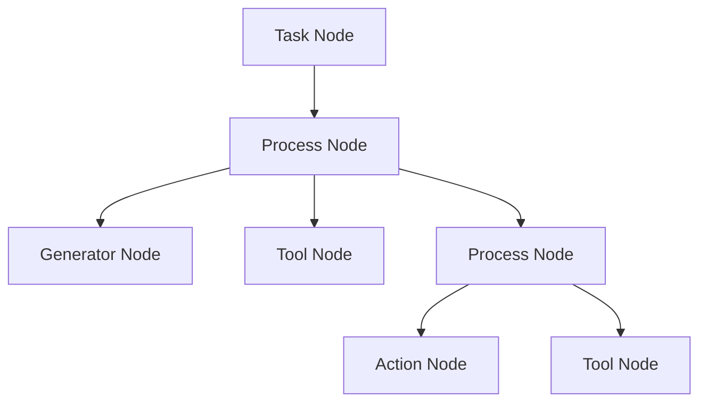

# 流程图：任务处理流程

本文档描述了系统的任务处理流程，从任务节点开始，经过多个处理节点，最终到达动作节点。

## 流程说明

1. **任务节点（T）**：流程的起点
2. **处理节点（P1）**：第一个处理阶段，可以产生生成器节点和工具节点
3. **处理节点（P2）**：第二个处理阶段，可以执行具体动作

## 流程图

### 图1：任务处理流程示意图

```mermaid
graph TD
    T[Task Node] --> P1[Process Node]
    P1 --> G1[Generator Node]
    P1 --> T1[Tool Node]
    P1 --> P2[Process Node]
    P2 --> A1[Action Node]
    P2 --> T2[Tool Node]
```
测试完毕
