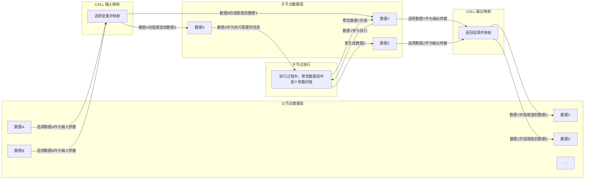

# 第六章：数据域模型

本章将阐述 **Mindloom** 系统中的数据模型以及执行节点的数据域规则。

Mindloom 的执行系统遵循 **节点级数据隔离模型**。  
在该模型中，所有数据仅存在于执行节点的局部作用域中，并通过 **CALL** 的输入与输出映射在节点之间进行传递。

这种设计保证了执行系统中的数据依赖关系始终是显式的。每一个执行节点都拥有独立的数据空间，节点之间不会共享状态，也无法直接访问彼此的数据。通过这种方式，Mindloom 的执行过程能够保持清晰、可追踪且可预测。

## 6.1 数据模型概述

在 Mindloom 的执行体系中，数据始终与 **节点（Node）** 绑定。

每个节点在运行时都会拥有独立的 **节点数据空间**，用于保存执行过程中所使用的数据。节点之间不会共享变量，也不存在全局数据区域。所有数据交换都必须通过 **CALL** 的输入与输出机制完成。

因此，Mindloom 的数据模型具有以下基本特征：

* 数据只存在于节点内部
* 节点之间不存在共享状态
* 数据通过调用关系在节点之间传递
* 数据生命周期与节点生命周期一致

通过这些规则，系统中的数据流动始终与执行结构保持一致，使得执行过程中的数据依赖关系能够被清晰理解和追踪。

## 6.2 节点的数据作用域

在 Mindloom 中，**执行节点是唯一的数据作用域单位**。

当一个节点被创建时，引擎会为该节点分配独立的数据空间，用于保存该节点在执行过程中所需要的全部数据。节点接收来自调用方的输入参数，并在执行过程中对这些数据进行处理，最终在节点结束时生成输出结果。

节点内部的数据通常经历三个阶段：

1. 节点创建时接收输入参数  
2. 节点执行过程中对数据进行处理与更新  
3. 节点结束时生成输出结果并返回调用方  

可以将这一过程理解为：

**输入数据 → 节点执行 → 输出结果**

在执行过程中，节点可以读取或修改自身的数据，但这些数据不会被其他节点直接访问。不同节点之间的数据始终保持隔离，从而避免复杂的共享状态问题。

## 6.3 调用中的数据传递

在 Mindloom 中，**CALL 是节点之间进行数据传递的唯一机制**。

当一个节点发起 CALL 时，会根据模板定义选择部分数据作为输入参数传递给被调用节点。被调用节点在执行过程中修改自身的数据域，并在执行完成后，将结果通过输出映射返回给调用节点。整个数据传递过程可以分为三个阶段：

1. **输入映射阶段**：父节点从自身数据域中选择部分变量，通过 CALL 的输入映射规则传递给子节点的对应变量。不是所有父节点变量都会传递，映射关系由模板明确指定。
2. **子节点执行阶段**：子节点使用映射后的输入参数进行执行，过程中可修改输入变量的值，并生成新的内部变量。所有中间变量在子节点内部可见，执行完成后，仅输出映射中定义的变量会返回给父节点。
3. **输出映射阶段**：子节点根据 CALL 输出映射规则，将指定结果变量写回父节点的数据域，从而完成一次结构化的数据传递。

在该结构中：

* `input` 定义了调用时需要传入的参数  
* `output` 定义了执行结果返回后如何写入调用节点的数据空间  

通过这种方式，节点之间的数据依赖始终显式体现，**不存在隐式共享或全局变量**，保证了执行语义的确定性与可追溯性。

## 6.4 参数传递语义

Mindloom 的参数传递采用 **值复制语义**。

当节点发起 CALL 时，传递给子节点的参数会被复制为新的输入数据，而不是以引用方式共享。这意味着子节点拥有独立的数据副本，其执行过程不会影响父节点的数据。

这种语义具有以下特点：

* 子节点无法直接修改父节点的数据
* 每个节点都拥有独立的数据副本
* 节点之间不存在共享变量

通过值复制机制，系统可以避免复杂的共享状态问题，同时保证节点之间的数据边界清晰可见。

## 6.5 数据生命周期

在 Mindloom 中，**数据的生命周期与节点的生命周期严格绑定**。

当节点被创建时，引擎会为其分配数据空间，并将输入参数写入该空间。在节点执行过程中，节点可以对这些数据进行读取与修改。当节点执行结束后，系统会生成输出结果并返回给调用方。

节点结束后，其内部数据空间会被释放，该节点的数据也随之消失。

因此，Mindloom 的运行过程中不会产生长期驻留的内部状态。所有节点的数据都只在其生命周期内存在，并随着节点的结束而被销毁。

## 6.6 并行执行中的数据语义

在并行流程中，多个 CALL 可以同时执行。

并行执行不会改变 Mindloom 的数据隔离原则。每个并行节点仍然拥有独立的数据作用域，并按照相同的调用机制进行数据传递。

需要注意的是，当多个并行 **CALL** 尝试将结果使用写入同一变量时，可能产生写入冲突。在这种情况下，变量的值是最后运行完的 CALL 覆盖的值。

因此，在设计并行流程时，通常应避免使用同一个变量名作为CALL输出的映射参数，在需要汇总多个并行结果的情况下，可以使用独立变量保存各个结果，并在后续流程中进行统一处理。

通过这种方式，系统仍然能够保持清晰的数据结构与执行逻辑。

## 6.7 持久数据与外部状态

Mindloom 的执行系统本身 **不提供持久数据存储能力**。

节点内部的数据只在执行期间存在。如果需要保存长期数据，例如业务数据、历史记录或外部系统状态，则必须通过外部系统实现。这类操作通常通过 **Tool** 或 **Action** 节点完成。

例如：

* 通过 Tool 访问数据库或文件系统
* 通过 Action 调用外部服务接口
* 通过外部系统保存长期业务数据

通过这种方式，Mindloom 将执行过程中的临时数据与系统外部的持久数据明确区分，从而保持执行系统本身的简洁与稳定。

## 6.8 跨数据域访问与共享语义

Mindloom 的基础执行语义**不支持全局变量、跨节点共享或直接交换数据**。

在某些场景下，需要跨节点共享数据或实现状态持久化时，可以通过 **Tool** 或 **Action** 节点访问外部系统或共享数据空间。此时，Tool 提供的数据访问能力需要用户自行控制，例如：

* 通过 Tool 提供的接口读取或写入共享变量；
* 使用 Tool 内部提供的锁机制，避免并行访问冲突或死锁；
* 通过外部系统管理数据一致性与事务边界，确保逻辑正确性。

这种设计使得 Mindloom 在保持严格数据隔离的基础上，仍可提供必要的灵活性。**跨数据域访问的控制责任完全由使用者承担**，系统本身不会自动管理共享状态。

通过明确区分节点内部数据与 Tool 提供的共享数据，Mindloom 保持了执行语义的清晰性与可预测性，同时允许在必要时实现受控的跨节点数据交换。
