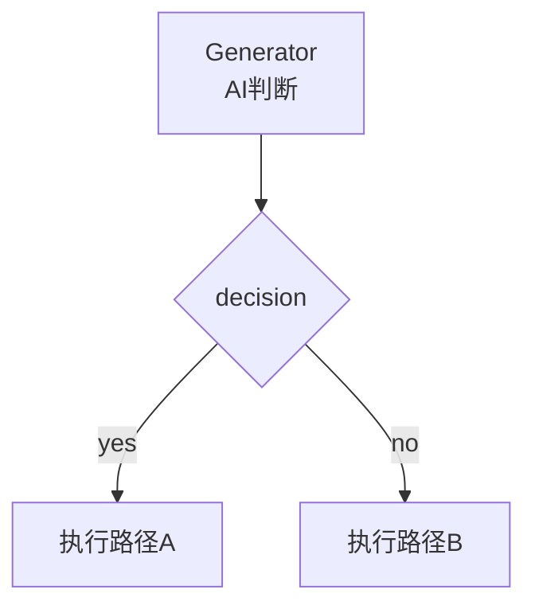
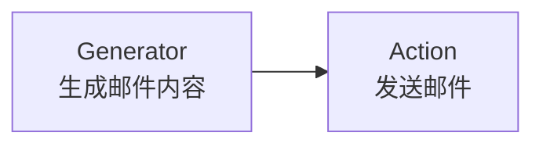
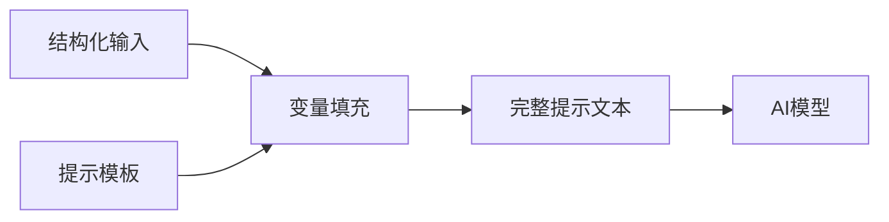
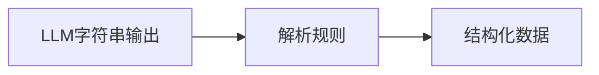
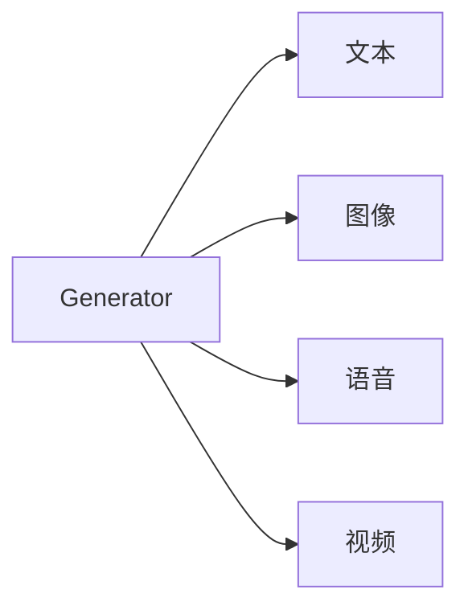

# 第七章：AI认知与生成模型（AI Cognitive & Generative Model）

## 7.1 AI在执行系统中的语义位置

在 Mindloom 的执行体系中，AI 并不是调度器，也不直接控制流程结构。  
AI 的能力被封装为一种 **执行器能力（Executor Capability）**，通过 **Generator** 单元参与到执行系统中。

Mindloom 将整个执行系统划分为三类能力：

| 能力类型 | 执行单元 | 作用 |
|---|---|---|
| 结构控制 | Process | 定义流程结构、分支、循环、并行等逻辑 |
| 认知与生成 | Generator | 调用 AI 模型进行内容生成与语义判断 |
| 现实交互 | Action | 与外部系统或现实世界交互 |

因此，一个完整的 Agent 执行体系可以抽象为：

```mermaid
flowchart LR

Process[Process<br>流程控制]

Generator[Generator<br>AI认知与生成]

Action[Action<br>现实系统交互]

Process --> Generator
Generator --> Process
Process --> Action
````

在该模型中：

* **Process** 决定执行结构
* **Generator** 提供认知能力
* **Action** 执行现实行为

这种设计保证：

* AI 能够参与决策
* AI 不会破坏执行结构
* 系统仍然保持确定性与可推理性

换言之：

> Mindloom 并不是让 AI 控制程序，而是让程序 **结构化地使用 AI 的能力**。

---

## 7.2 Generator：生成式执行器

**Generator** 是一种以生成式 AI 模型为核心的执行器（Executor）。

其核心职责是：

* 调用 AI 模型完成一次生成式计算
* 将生成结果转换为结构化输出
* 将结果返回给调用节点

Generator 的执行过程本质上是一次 **模型交互过程**。

```mermaid
flowchart LR

Inputs[结构化输入]
Prompt[提示模板构建]
API[调用AI模型API]
Output[模型字符串输出]
Parse[结构化解析]
Result[结构化结果]

Inputs --> Prompt
Prompt --> API
API --> Output
Output --> Parse
Parse --> Result
```

Generator 具备以下语义特征：

* 执行依赖于外部 AI 模型
* 输出结果可能具备概率性
* 执行目标通常是生成文本、语义判断或中间结果

Generator **只负责生成结果**，不参与后续流程控制。

流程控制始终由 **Process 单元** 完成。

---

## 7.3 AI参与决策的执行模式

AI 可以参与执行决策，但不会直接控制执行结构。

Generator 的输出可以作为 **结构化判断结果**，供 Process 节点进行流程分支。

例如：

```json
{
  "decision": "yes"
}
```

Process 可以根据返回结果决定后续路径：



在该模式中：

* AI 负责语义判断
* Process 负责流程控制

这种机制实现了：

**AI参与思考，但不掌控执行结构。**

---

## 7.4 AI内容生成的执行模式

除了决策能力外，AI 还可以作为 **内容生成器**。

Generator 可以生成：

* 文本
* 文档
* 回复消息
* 指令
* 数据结构

这些内容通常作为后续 Action 的输入。

例如：



典型执行模式：

```
Generator → 生成内容
Action → 执行现实行为
```

例如：

* 生成邮件内容 → 发送邮件
* 生成聊天回复 → 发送消息
* 生成语音文本 → 语音播报

在该模式中：

AI 负责 **生成内容**，而现实交互由 **Action** 完成。

---

## 7.5 提示模板填充语义

AI API 接收的数据本质上是 **字符串 Token**。
而 Mindloom 的执行系统采用 **结构化输入参数**。

因此 Generator 需要完成一个关键任务：

**将结构化参数转换为提示文本。**

这一过程称为：

**模板填充（Prompt Binding）**

执行流程：



提示模板的填充方式由 **模板解析模式（Parse Mode）** 定义。

当前支持的模式：

```python
PARSE_MODE_TYPE = [
  "static",
  "jinjia2",
  "regex"
]
```

| 模式     | 说明        |
| ------ | --------- |
| static | 简单变量替换    |
| jinja2 | 模板引擎      |
| regex  | 正则表达式匹配替换 |

通过这些机制，提示工程师可以灵活构建提示模板。

---

## 7.6 结果解析与结构化输出

AI 模型返回的数据通常为 **字符串 Token 序列**。

为了让执行系统能够理解这些结果，需要将其转换为结构化参数。

这一过程称为：

**结果解析（Result Extraction）**



解析模式定义如下：

```python
EXTRACT_MODE_TYPE = [
  "regex",
  "json",
  "xml",
  "yaml"
]
```

| 模式    | 说明       |
| ----- | -------- |
| regex | 正则表达式提取  |
| json  | JSON结构解析 |
| xml   | XML结构解析  |
| yaml  | YAML结构解析 |

例如：

模型输出：

```
{
 "decision": "yes"
}
```

解析后得到：

```json
{
  "decision": "yes"
}
```

这些结果将作为 Generator 的结构化输出返回给调用节点。

---

## 7.7 模型接口与部署方式

Generator 并不绑定具体的 AI 模型或服务。

其执行语义仅定义为：

```
输入 → 模型调用 → 输出
```

模型实现可以来自不同来源：

| 类型     | 示例                       |
| ------ | ------------------------ |
| 公有云模型  | GPT、Gemini、Qwen、DeepSeek |
| 私有部署模型 | 本地部署LLM                  |
| 企业内部模型 | 私有AI平台                   |

Generator 可以调用多种 AI API 形式：

* Chat Completion
* Embedding
* Multimodal Generation

例如典型 Chat API 结构：

```json
[
  {"role":"system","content":"..."},
  {"role":"user","content":"..."},
  {"role":"assistant","content":"..."}
]
```

Mindloom 并不限制模型来源。

只要满足 **输入输出契约**，均可接入执行系统。

---

## 7.8 多模态扩展方向

当前 Mindloom 的基础数据类型以 **文本结构数据** 为主。

未来 Generator 将支持多模态能力，包括：

* 图像生成
* 语音生成
* 视频生成
* 多模态理解

例如：

```json
{
  "voice": "voice_data",
  "image": "image_data"
}
```

这些能力将通过新的数据类型扩展进入执行系统。



通过多模态能力，Mindloom 可以支持更复杂的 Agent 形态，例如：

* 语音助手
* 多模态客服
* 智能机器人
* 视觉识别系统

---

## 本章总结

Generator 的引入，使 Mindloom 执行系统具备了 **认知能力与生成能力**。

通过结构化输入与输出机制，AI 的概率生成能力被纳入可控的执行框架中。

在 Mindloom 的语义体系中：

* **Process** 定义执行结构
* **Generator** 提供认知与生成能力
* **Action** 执行现实行为

这种设计使 AI 能够参与工作流，同时保持系统的结构确定性。

因此，Mindloom 并不仅仅是一个执行引擎，而是一个能够 **结构化利用 AI 能力的 Agent 执行系统**。
